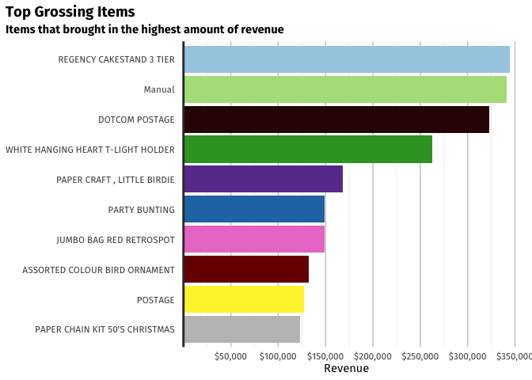

Association Analysis
================
Varun Manoj
20/05/2021

## Introduction

Following last month’s blog post, I’ll look to provide some additional
analytical methods that we can apply on sales transaction data. The
method that we’ll explore in this post can be applied to any form of
sales data, from e-commerce sites or traditional brick and mortar
stores. Association analysis can be used to derive crucial insights to
inform business decisions concerning three of the four P’s of
marketing–product, positioning and price–and can be used to guide
decision-making in the digital era.

> [**Association
> Analysis**](https://www.jmp.com/support/help/en/15.2/index.shtml#page/jmp/association-analysis.shtml)
> enables you to identify items that have an affinity for each other. It
> is frequently used to analyze transactional data (also called market
> baskets) to identify items that often appear together in transactions.
> For example, grocery stores and online merchants use association
> analysis to strategically organize and recommend products that tend to
> be purchased together.

## Data Preprocessing

This blog’s dataset is actually an extension from last month’s dataset.
I wanted to test myself with a larger dataset but couldn’t seem to find
an appropriate one until I stumbled upon [retail
data](https://archive.ics.uci.edu/ml/datasets/Online+Retail+II) of the
two years prior to the previously used dataset. In case you missed the
last blog post, here’s a
[recap](https://varunmanoj.blog/2021/01/27/clustering-from-sales-trancation-data/)
of the dataset from the last blog post.

The goal of data preprocessing often differs with the choice of
analytical model. We need a very particular format of data for
association analysis: two columns, one with an invoice or transaction
ID, and the other with a column of items purchased by description.
Keeping that goal in mind, we can manipulate our dataset accordingly to
transform it to the desired format. We must note that this format is
inconsistent with [tidy data
principles](https://cran.r-project.org/web/packages/tidyr/vignettes/tidy-data.html),
however it’s required for this type of analysis. We begin the analysis
by importing the two different transaction record files and combining
them into one data frame. We need to be careful about naming
conventions, as we can already see some inconsistency between the two
sets of transaction data. We can fix the problem by using the `rename()`
function, and rename the columns ‘Price’, ‘Invoice’ and ‘Customer ID’ to
‘UnitPrice’, ‘InvoiceNo’ and ‘CustomerID’ respectively.

``` r
#Read both transaction records
#If not initialised, set your working directory by using setwd()
retail_old <- read_excel("online_retail_II.xlsx")
retail_new <- read_excel("Online Retail.xlsx")

#Use standardized naming conventions
retail_old <- retail_old %>%
  rename(c("Invoice" = "InvoiceNo", "Price" = "UnitPrice" , `Customer ID` = "CustomerID"))

#Combine rows, this is a base R function with the tidyverse version being rbind()
retail <- bind_rows(retail_new, retail_old)

#Find summary statistics
summary(retail)
```

    ##   InvoiceNo          StockCode         Description           Quantity        
    ##  Length:1067370     Length:1067370     Length:1067370     Min.   :-80995.00  
    ##  Class :character   Class :character   Class :character   1st Qu.:     1.00  
    ##  Mode  :character   Mode  :character   Mode  :character   Median :     3.00  
    ##                                                           Mean   :     9.94  
    ##                                                           3rd Qu.:    10.00  
    ##                                                           Max.   : 80995.00  
    ##                                                                              
    ##   InvoiceDate                    UnitPrice           CustomerID    
    ##  Min.   :2009-12-01 07:45:00   Min.   :-53594.36   Min.   :12346   
    ##  1st Qu.:2010-07-09 09:46:00   1st Qu.:     1.25   1st Qu.:13975   
    ##  Median :2010-12-07 15:28:00   Median :     2.10   Median :15255   
    ##  Mean   :2011-01-02 21:13:27   Mean   :     4.65   Mean   :15325   
    ##  3rd Qu.:2011-07-22 10:23:00   3rd Qu.:     4.15   3rd Qu.:16797   
    ##  Max.   :2011-12-09 12:50:00   Max.   : 38970.00   Max.   :18287   
    ##                                                    NA's   :243007  
    ##    Country         
    ##  Length:1067370    
    ##  Class :character  
    ##  Mode  :character  
    ##                    
    ##                    
    ##                    
    ## 

The combined dataset 1,067,370 observations but the data’s far from
clean. We can see a couple of problems from the results of the
`summary()` function: over 240,000 records have NA’s in the CustomerID
variable, at least 1 record has a negative UnitPrice and at least 1
record has a negative Quantity. We don’t need to be worried about the
CustomerID variable for association analysis, but we do need to ensure
our dataset has only positive values for UnitPrice and Quantity. We can
filter for our requirements using the `filter()` function and confirm we
have a complete datatset by checking the `is.na()` function:

``` r
#Include only positive values
retail_clean <- retail %>%
  filter(Quantity > 0 & UnitPrice > 0)

#Check for presence of NAs
retail_clean %>%
  filter(is.na(Description))
```

    ## # A tibble: 0 x 8
    ## # … with 8 variables: InvoiceNo <chr>, StockCode <chr>, Description <chr>,
    ## #   Quantity <dbl>, InvoiceDate <dttm>, UnitPrice <dbl>, CustomerID <dbl>,
    ## #   Country <chr>

This data frame seems to have complete data for all the variables that
we require. Next, let’s explore the StockCode column to check if there
are any problems. We can see that there are three main types of
StockCode variables: numeric, alpha-numeric and alphabets. This is a
perfect opportunity to use some REGEX to differentiate observations and
determine whether or not to include certain observations. We can begin
by using REGEX to filter out all non-numeric StockCodes by using the
`grepl()` function to specify our regular expression.

``` r
#Data's clean but not clean enough, there are still StockCodes such as M, Amazonfee etc. that need to be removed
#Let's see all the non-numeric StockCodes
misc_StockCode <- retail_clean %>%
  filter(!grepl('^[0-9]', StockCode))
```

<br> There are only 4,793 observations with these ‘miscellaneous’
StockCodes, however they can still affect our association analysis and
must examine these variables. Upon inspection of these observations, we
can see that there are StockCodes that resemble ‘Postage’, ‘Manual’ and
‘Dotcom Postage’, all of which aren’t items that are sold by the
retailer. On the contrary, there are StockCodes such as ‘C2’ and ‘gift’
which resemble ‘Carriage’ and ‘Gift card’ respectively and are items
that the retailer sells. We need to use our own judgement here to
determine whether to include certain observations, and I feel a good
rule of thumb is keep items that have multiple observations with the
same StockCode, Description and UnitPrice, and discard the rest. This
shows that an item is consistently priced for the same description,
hence must be an item sold by the retailer. We can modify the previous
REGEX to include non-numerics, along with StockCodes that begin with
‘DCGS’, ‘gift’, ‘C2’ and ‘SP’. We’ve display some of these ‘good’ and
‘bad’ StockCodes in a tabular format below. We can subsequently update
the retail\_clean data frame to exclude those observations. <br> <br>
<!-- -->

## Data Integrity

The inconsistent naming conventions that we observed in the previous
section is a red flag that other elements of the dataset might need
further inspection. Upon taking a glance at the observations we can see
that there’s potentially naming inconsistencies in the database. One
StockCode could have multiple descriptions and one Description could
have multiple StockCodes. This is a sign of poor database design and can
lead to serious problems if unaddressed. We can explore some of the
duplicate StockCode and Description combinations and subsequently make a
decision on how to deal with those. <br>

<div id="oetnfizvyk" style="overflow-x:auto;overflow-y:auto;width:auto;height:auto;">
<style>html {
  font-family: -apple-system, BlinkMacSystemFont, 'Segoe UI', Roboto, Oxygen, Ubuntu, Cantarell, 'Helvetica Neue', 'Fira Sans', 'Droid Sans', Arial, sans-serif;
}

#oetnfizvyk .gt_table {
  display: table;
  border-collapse: collapse;
  margin-left: auto;
  margin-right: auto;
  color: #333333;
  font-size: 90%;
  font-weight: normal;
  font-style: normal;
  background-color: #FFFFFF;
  width: auto;
  border-top-style: solid;
  border-top-width: 10px;
  border-top-color: #A8A8A8;
  border-right-style: none;
  border-right-width: 2px;
  border-right-color: #D3D3D3;
  border-bottom-style: solid;
  border-bottom-width: 2px;
  border-bottom-color: #A8A8A8;
  border-left-style: none;
  border-left-width: 2px;
  border-left-color: #D3D3D3;
}

#oetnfizvyk .gt_heading {
  background-color: #FFFFFF;
  text-align: center;
  border-bottom-color: #FFFFFF;
  border-left-style: none;
  border-left-width: 1px;
  border-left-color: #D3D3D3;
  border-right-style: none;
  border-right-width: 1px;
  border-right-color: #D3D3D3;
}

#oetnfizvyk .gt_title {
  color: #333333;
  font-size: 125%;
  font-weight: initial;
  padding-top: 4px;
  padding-bottom: 4px;
  border-bottom-color: #FFFFFF;
  border-bottom-width: 0;
}

#oetnfizvyk .gt_subtitle {
  color: #333333;
  font-size: 85%;
  font-weight: initial;
  padding-top: 0;
  padding-bottom: 4px;
  border-top-color: #FFFFFF;
  border-top-width: 0;
}

#oetnfizvyk .gt_bottom_border {
  border-bottom-style: solid;
  border-bottom-width: 10px;
  border-bottom-color: #A8A8A8;
}

#oetnfizvyk .gt_col_headings {
  border-top-style: solid;
  border-top-width: 2px;
  border-top-color: #D3D3D3;
  border-bottom-style: solid;
  border-bottom-width: 2px;
  border-bottom-color: #D3D3D3;
  border-left-style: none;
  border-left-width: 1px;
  border-left-color: #D3D3D3;
  border-right-style: none;
  border-right-width: 1px;
  border-right-color: #D3D3D3;
}

#oetnfizvyk .gt_col_heading {
  color: #333333;
  background-color: #FFFFFF;
  font-size: 100%;
  font-weight: normal;
  text-transform: inherit;
  border-left-style: none;
  border-left-width: 1px;
  border-left-color: #D3D3D3;
  border-right-style: none;
  border-right-width: 1px;
  border-right-color: #D3D3D3;
  vertical-align: bottom;
  padding-top: 5px;
  padding-bottom: 6px;
  padding-left: 5px;
  padding-right: 5px;
  overflow-x: hidden;
}

#oetnfizvyk .gt_column_spanner_outer {
  color: #333333;
  background-color: #FFFFFF;
  font-size: 100%;
  font-weight: normal;
  text-transform: inherit;
  padding-top: 0;
  padding-bottom: 0;
  padding-left: 4px;
  padding-right: 4px;
}

#oetnfizvyk .gt_column_spanner_outer:first-child {
  padding-left: 0;
}

#oetnfizvyk .gt_column_spanner_outer:last-child {
  padding-right: 0;
}

#oetnfizvyk .gt_column_spanner {
  border-bottom-style: solid;
  border-bottom-width: 2px;
  border-bottom-color: #D3D3D3;
  vertical-align: bottom;
  padding-top: 5px;
  padding-bottom: 6px;
  overflow-x: hidden;
  display: inline-block;
  width: 100%;
}

#oetnfizvyk .gt_group_heading {
  padding: 8px;
  color: #333333;
  background-color: #FFFFFF;
  font-size: 100%;
  font-weight: initial;
  text-transform: inherit;
  border-top-style: solid;
  border-top-width: 2px;
  border-top-color: #D3D3D3;
  border-bottom-style: solid;
  border-bottom-width: 2px;
  border-bottom-color: #D3D3D3;
  border-left-style: none;
  border-left-width: 1px;
  border-left-color: #D3D3D3;
  border-right-style: none;
  border-right-width: 1px;
  border-right-color: #D3D3D3;
  vertical-align: middle;
}

#oetnfizvyk .gt_empty_group_heading {
  padding: 0.5px;
  color: #333333;
  background-color: #FFFFFF;
  font-size: 100%;
  font-weight: initial;
  border-top-style: solid;
  border-top-width: 2px;
  border-top-color: #D3D3D3;
  border-bottom-style: solid;
  border-bottom-width: 2px;
  border-bottom-color: #D3D3D3;
  vertical-align: middle;
}

#oetnfizvyk .gt_from_md > :first-child {
  margin-top: 0;
}

#oetnfizvyk .gt_from_md > :last-child {
  margin-bottom: 0;
}

#oetnfizvyk .gt_row {
  padding-top: 8px;
  padding-bottom: 8px;
  padding-left: 5px;
  padding-right: 5px;
  margin: 10px;
  border-top-style: solid;
  border-top-width: 1px;
  border-top-color: #D3D3D3;
  border-left-style: none;
  border-left-width: 1px;
  border-left-color: #D3D3D3;
  border-right-style: none;
  border-right-width: 1px;
  border-right-color: #D3D3D3;
  vertical-align: middle;
  overflow-x: hidden;
}

#oetnfizvyk .gt_stub {
  color: #333333;
  background-color: #FFFFFF;
  font-size: 100%;
  font-weight: initial;
  text-transform: inherit;
  border-right-style: solid;
  border-right-width: 2px;
  border-right-color: #D3D3D3;
  padding-left: 12px;
}

#oetnfizvyk .gt_summary_row {
  color: #333333;
  background-color: #FFFFFF;
  text-transform: inherit;
  padding-top: 8px;
  padding-bottom: 8px;
  padding-left: 5px;
  padding-right: 5px;
}

#oetnfizvyk .gt_first_summary_row {
  padding-top: 8px;
  padding-bottom: 8px;
  padding-left: 5px;
  padding-right: 5px;
  border-top-style: solid;
  border-top-width: 2px;
  border-top-color: #D3D3D3;
}

#oetnfizvyk .gt_grand_summary_row {
  color: #333333;
  background-color: #FFFFFF;
  text-transform: inherit;
  padding-top: 8px;
  padding-bottom: 8px;
  padding-left: 5px;
  padding-right: 5px;
}

#oetnfizvyk .gt_first_grand_summary_row {
  padding-top: 8px;
  padding-bottom: 8px;
  padding-left: 5px;
  padding-right: 5px;
  border-top-style: double;
  border-top-width: 6px;
  border-top-color: #D3D3D3;
}

#oetnfizvyk .gt_striped {
  background-color: rgba(128, 128, 128, 0.05);
}

#oetnfizvyk .gt_table_body {
  border-top-style: solid;
  border-top-width: 2px;
  border-top-color: #D3D3D3;
  border-bottom-style: solid;
  border-bottom-width: 2px;
  border-bottom-color: #D3D3D3;
}

#oetnfizvyk .gt_footnotes {
  color: #333333;
  background-color: #FFFFFF;
  border-bottom-style: none;
  border-bottom-width: 2px;
  border-bottom-color: #D3D3D3;
  border-left-style: none;
  border-left-width: 2px;
  border-left-color: #D3D3D3;
  border-right-style: none;
  border-right-width: 2px;
  border-right-color: #D3D3D3;
}

#oetnfizvyk .gt_footnote {
  margin: 0px;
  font-size: 90%;
  padding: 4px;
}

#oetnfizvyk .gt_sourcenotes {
  color: #333333;
  background-color: #FFFFFF;
  border-bottom-style: none;
  border-bottom-width: 2px;
  border-bottom-color: #D3D3D3;
  border-left-style: none;
  border-left-width: 2px;
  border-left-color: #D3D3D3;
  border-right-style: none;
  border-right-width: 2px;
  border-right-color: #D3D3D3;
}

#oetnfizvyk .gt_sourcenote {
  font-size: 90%;
  padding: 4px;
}

#oetnfizvyk .gt_left {
  text-align: left;
}

#oetnfizvyk .gt_center {
  text-align: center;
}

#oetnfizvyk .gt_right {
  text-align: right;
  font-variant-numeric: tabular-nums;
}

#oetnfizvyk .gt_font_normal {
  font-weight: normal;
}

#oetnfizvyk .gt_font_bold {
  font-weight: bold;
}

#oetnfizvyk .gt_font_italic {
  font-style: italic;
}

#oetnfizvyk .gt_super {
  font-size: 65%;
}

#oetnfizvyk .gt_footnote_marks {
  font-style: italic;
  font-weight: normal;
  font-size: 65%;
}
</style>
<table class="gt_table" style="table-layout: fixed;">
  <colgroup>
    <col style="width:100px;"/>
    <col/>
    <col style="width:100px;"/>
  </colgroup>
  <thead class="gt_header">
    <tr>
      <th colspan="3" class="gt_heading gt_title gt_font_normal" style="font-family: &#39;Fira Sans&#39;;"><strong>Duplicate Descriptions</strong></th>
    </tr>
    <tr>
      <th colspan="3" class="gt_heading gt_subtitle gt_font_normal gt_bottom_border" style="font-family: &#39;Fira Sans&#39;;">Same <em>Descriptions</em> with Different <em>StockCodes</em></th>
    </tr>
  </thead>
  <thead class="gt_col_headings">
    <tr>
      <th class="gt_col_heading gt_columns_bottom_border gt_left" rowspan="1" colspan="1" style="font-weight: bold; font-family: &#39;Fira Sans&#39;;">StockCode</th>
      <th class="gt_col_heading gt_columns_bottom_border gt_left" rowspan="1" colspan="1" style="font-weight: bold; font-family: &#39;Fira Sans&#39;;">Description</th>
      <th class="gt_col_heading gt_columns_bottom_border gt_center" rowspan="1" colspan="1" style="font-weight: bold; font-family: &#39;Fira Sans&#39;;">Number of Duplicates</th>
    </tr>
  </thead>
  <tbody class="gt_table_body">
    <tr><td class="gt_row gt_left" style="background-color: #BCFFC0; font-family: 'Fira Sans';">82613B</td>
<td class="gt_row gt_left" style="background-color: #BCFFC0; font-family: 'Fira Sans';">METAL SIGN,CUPCAKE SINGLE HOOK</td>
<td class="gt_row gt_center" style="background-color: #BCFFC0; font-family: 'Fira Sans';">6</td></tr>
    <tr><td class="gt_row gt_left" style="background-color: #BCFFC0; font-family: 'Fira Sans';">82613C</td>
<td class="gt_row gt_left" style="background-color: #BCFFC0; font-family: 'Fira Sans';">METAL SIGN,CUPCAKE SINGLE HOOK</td>
<td class="gt_row gt_center" style="background-color: #BCFFC0; font-family: 'Fira Sans';">6</td></tr>
    <tr><td class="gt_row gt_left" style="background-color: #BCFFC0; font-family: 'Fira Sans';">82613A</td>
<td class="gt_row gt_left" style="background-color: #BCFFC0; font-family: 'Fira Sans';">METAL SIGN,CUPCAKE SINGLE HOOK</td>
<td class="gt_row gt_center" style="background-color: #BCFFC0; font-family: 'Fira Sans';">6</td></tr>
    <tr><td class="gt_row gt_left" style="background-color: #BCFFC0; font-family: 'Fira Sans';">82613b</td>
<td class="gt_row gt_left" style="background-color: #BCFFC0; font-family: 'Fira Sans';">METAL SIGN,CUPCAKE SINGLE HOOK</td>
<td class="gt_row gt_center" style="background-color: #BCFFC0; font-family: 'Fira Sans';">6</td></tr>
    <tr><td class="gt_row gt_left" style="background-color: #BCFFC0; font-family: 'Fira Sans';">82613c</td>
<td class="gt_row gt_left" style="background-color: #BCFFC0; font-family: 'Fira Sans';">METAL SIGN,CUPCAKE SINGLE HOOK</td>
<td class="gt_row gt_center" style="background-color: #BCFFC0; font-family: 'Fira Sans';">6</td></tr>
    <tr><td class="gt_row gt_left" style="background-color: #BCFFC0; font-family: 'Fira Sans';">82613a</td>
<td class="gt_row gt_left" style="background-color: #BCFFC0; font-family: 'Fira Sans';">METAL SIGN,CUPCAKE SINGLE HOOK</td>
<td class="gt_row gt_center" style="background-color: #BCFFC0; font-family: 'Fira Sans';">6</td></tr>
    <tr><td class="gt_row gt_left" style="background-color: #FEFFBB; font-family: 'Fira Sans';">72127</td>
<td class="gt_row gt_left" style="background-color: #FEFFBB; font-family: 'Fira Sans';">COLUMBIAN CANDLE ROUND</td>
<td class="gt_row gt_center" style="background-color: #FEFFBB; font-family: 'Fira Sans';">4</td></tr>
    <tr><td class="gt_row gt_left" style="background-color: #FEFFBB; font-family: 'Fira Sans';">72130</td>
<td class="gt_row gt_left" style="background-color: #FEFFBB; font-family: 'Fira Sans';">COLUMBIAN CANDLE ROUND</td>
<td class="gt_row gt_center" style="background-color: #FEFFBB; font-family: 'Fira Sans';">4</td></tr>
    <tr><td class="gt_row gt_left" style="background-color: #FEFFBB; font-family: 'Fira Sans';">72128</td>
<td class="gt_row gt_left" style="background-color: #FEFFBB; font-family: 'Fira Sans';">COLUMBIAN CANDLE ROUND</td>
<td class="gt_row gt_center" style="background-color: #FEFFBB; font-family: 'Fira Sans';">4</td></tr>
    <tr><td class="gt_row gt_left" style="background-color: #FEFFBB; font-family: 'Fira Sans';">72129</td>
<td class="gt_row gt_left" style="background-color: #FEFFBB; font-family: 'Fira Sans';">COLUMBIAN CANDLE ROUND</td>
<td class="gt_row gt_center" style="background-color: #FEFFBB; font-family: 'Fira Sans';">4</td></tr>
    <tr><td class="gt_row gt_left" style="background-color: #BCC5FF; font-family: 'Fira Sans';">84509B</td>
<td class="gt_row gt_left" style="background-color: #BCC5FF; font-family: 'Fira Sans';">SET OF 4 FAIRY CAKE PLACEMATS</td>
<td class="gt_row gt_center" style="background-color: #BCC5FF; font-family: 'Fira Sans';">4</td></tr>
    <tr><td class="gt_row gt_left" style="background-color: #BCC5FF; font-family: 'Fira Sans';">84509G</td>
<td class="gt_row gt_left" style="background-color: #BCC5FF; font-family: 'Fira Sans';">SET OF 4 FAIRY CAKE PLACEMATS</td>
<td class="gt_row gt_center" style="background-color: #BCC5FF; font-family: 'Fira Sans';">4</td></tr>
    <tr><td class="gt_row gt_left" style="background-color: #BCC5FF; font-family: 'Fira Sans';">84509b</td>
<td class="gt_row gt_left" style="background-color: #BCC5FF; font-family: 'Fira Sans';">SET OF 4 FAIRY CAKE PLACEMATS</td>
<td class="gt_row gt_center" style="background-color: #BCC5FF; font-family: 'Fira Sans';">4</td></tr>
    <tr><td class="gt_row gt_left" style="background-color: #BCC5FF; font-family: 'Fira Sans';">84509g</td>
<td class="gt_row gt_left" style="background-color: #BCC5FF; font-family: 'Fira Sans';">SET OF 4 FAIRY CAKE PLACEMATS</td>
<td class="gt_row gt_center" style="background-color: #BCC5FF; font-family: 'Fira Sans';">4</td></tr>
    <tr><td class="gt_row gt_left" style="background-color: #C5987B; font-family: 'Fira Sans';">10133</td>
<td class="gt_row gt_left" style="background-color: #C5987B; font-family: 'Fira Sans';">COLOURING PENCILS BROWN TUBE</td>
<td class="gt_row gt_center" style="background-color: #C5987B; font-family: 'Fira Sans';">3</td></tr>
    <tr><td class="gt_row gt_left" style="background-color: #C5987B; font-family: 'Fira Sans';">10135</td>
<td class="gt_row gt_left" style="background-color: #C5987B; font-family: 'Fira Sans';">COLOURING PENCILS BROWN TUBE</td>
<td class="gt_row gt_center" style="background-color: #C5987B; font-family: 'Fira Sans';">3</td></tr>
    <tr><td class="gt_row gt_left" style="background-color: #C5987B; font-family: 'Fira Sans';">10134</td>
<td class="gt_row gt_left" style="background-color: #C5987B; font-family: 'Fira Sans';">COLOURING PENCILS BROWN TUBE</td>
<td class="gt_row gt_center" style="background-color: #C5987B; font-family: 'Fira Sans';">3</td></tr>
    <tr><td class="gt_row gt_left" style="background-color: #FFDAFD; font-family: 'Fira Sans';">20884</td>
<td class="gt_row gt_left" style="background-color: #FFDAFD; font-family: 'Fira Sans';">MODERN CHRISTMAS TREE CANDLE</td>
<td class="gt_row gt_center" style="background-color: #FFDAFD; font-family: 'Fira Sans';">3</td></tr>
    <tr><td class="gt_row gt_left" style="background-color: #FFDAFD; font-family: 'Fira Sans';">20881</td>
<td class="gt_row gt_left" style="background-color: #FFDAFD; font-family: 'Fira Sans';">MODERN CHRISTMAS TREE CANDLE</td>
<td class="gt_row gt_center" style="background-color: #FFDAFD; font-family: 'Fira Sans';">3</td></tr>
    <tr><td class="gt_row gt_left" style="background-color: #FFDAFD; font-family: 'Fira Sans';">20882</td>
<td class="gt_row gt_left" style="background-color: #FFDAFD; font-family: 'Fira Sans';">MODERN CHRISTMAS TREE CANDLE</td>
<td class="gt_row gt_center" style="background-color: #FFDAFD; font-family: 'Fira Sans';">3</td></tr>
  </tbody>
  
  
</table>
</div>

<br> <br>

<div id="djrydhylau" style="overflow-x:auto;overflow-y:auto;width:auto;height:auto;">
<style>html {
  font-family: -apple-system, BlinkMacSystemFont, 'Segoe UI', Roboto, Oxygen, Ubuntu, Cantarell, 'Helvetica Neue', 'Fira Sans', 'Droid Sans', Arial, sans-serif;
}

#djrydhylau .gt_table {
  display: table;
  border-collapse: collapse;
  margin-left: auto;
  margin-right: auto;
  color: #333333;
  font-size: 90%;
  font-weight: normal;
  font-style: normal;
  background-color: #FFFFFF;
  width: auto;
  border-top-style: solid;
  border-top-width: 10px;
  border-top-color: #A8A8A8;
  border-right-style: none;
  border-right-width: 2px;
  border-right-color: #D3D3D3;
  border-bottom-style: solid;
  border-bottom-width: 2px;
  border-bottom-color: #A8A8A8;
  border-left-style: none;
  border-left-width: 2px;
  border-left-color: #D3D3D3;
}

#djrydhylau .gt_heading {
  background-color: #FFFFFF;
  text-align: center;
  border-bottom-color: #FFFFFF;
  border-left-style: none;
  border-left-width: 1px;
  border-left-color: #D3D3D3;
  border-right-style: none;
  border-right-width: 1px;
  border-right-color: #D3D3D3;
}

#djrydhylau .gt_title {
  color: #333333;
  font-size: 125%;
  font-weight: initial;
  padding-top: 4px;
  padding-bottom: 4px;
  border-bottom-color: #FFFFFF;
  border-bottom-width: 0;
}

#djrydhylau .gt_subtitle {
  color: #333333;
  font-size: 85%;
  font-weight: initial;
  padding-top: 0;
  padding-bottom: 4px;
  border-top-color: #FFFFFF;
  border-top-width: 0;
}

#djrydhylau .gt_bottom_border {
  border-bottom-style: solid;
  border-bottom-width: 10px;
  border-bottom-color: #A8A8A8;
}

#djrydhylau .gt_col_headings {
  border-top-style: solid;
  border-top-width: 2px;
  border-top-color: #D3D3D3;
  border-bottom-style: solid;
  border-bottom-width: 2px;
  border-bottom-color: #D3D3D3;
  border-left-style: none;
  border-left-width: 1px;
  border-left-color: #D3D3D3;
  border-right-style: none;
  border-right-width: 1px;
  border-right-color: #D3D3D3;
}

#djrydhylau .gt_col_heading {
  color: #333333;
  background-color: #FFFFFF;
  font-size: 100%;
  font-weight: normal;
  text-transform: inherit;
  border-left-style: none;
  border-left-width: 1px;
  border-left-color: #D3D3D3;
  border-right-style: none;
  border-right-width: 1px;
  border-right-color: #D3D3D3;
  vertical-align: bottom;
  padding-top: 5px;
  padding-bottom: 6px;
  padding-left: 5px;
  padding-right: 5px;
  overflow-x: hidden;
}

#djrydhylau .gt_column_spanner_outer {
  color: #333333;
  background-color: #FFFFFF;
  font-size: 100%;
  font-weight: normal;
  text-transform: inherit;
  padding-top: 0;
  padding-bottom: 0;
  padding-left: 4px;
  padding-right: 4px;
}

#djrydhylau .gt_column_spanner_outer:first-child {
  padding-left: 0;
}

#djrydhylau .gt_column_spanner_outer:last-child {
  padding-right: 0;
}

#djrydhylau .gt_column_spanner {
  border-bottom-style: solid;
  border-bottom-width: 2px;
  border-bottom-color: #D3D3D3;
  vertical-align: bottom;
  padding-top: 5px;
  padding-bottom: 6px;
  overflow-x: hidden;
  display: inline-block;
  width: 100%;
}

#djrydhylau .gt_group_heading {
  padding: 8px;
  color: #333333;
  background-color: #FFFFFF;
  font-size: 100%;
  font-weight: initial;
  text-transform: inherit;
  border-top-style: solid;
  border-top-width: 2px;
  border-top-color: #D3D3D3;
  border-bottom-style: solid;
  border-bottom-width: 2px;
  border-bottom-color: #D3D3D3;
  border-left-style: none;
  border-left-width: 1px;
  border-left-color: #D3D3D3;
  border-right-style: none;
  border-right-width: 1px;
  border-right-color: #D3D3D3;
  vertical-align: middle;
}

#djrydhylau .gt_empty_group_heading {
  padding: 0.5px;
  color: #333333;
  background-color: #FFFFFF;
  font-size: 100%;
  font-weight: initial;
  border-top-style: solid;
  border-top-width: 2px;
  border-top-color: #D3D3D3;
  border-bottom-style: solid;
  border-bottom-width: 2px;
  border-bottom-color: #D3D3D3;
  vertical-align: middle;
}

#djrydhylau .gt_from_md > :first-child {
  margin-top: 0;
}

#djrydhylau .gt_from_md > :last-child {
  margin-bottom: 0;
}

#djrydhylau .gt_row {
  padding-top: 8px;
  padding-bottom: 8px;
  padding-left: 5px;
  padding-right: 5px;
  margin: 10px;
  border-top-style: solid;
  border-top-width: 1px;
  border-top-color: #D3D3D3;
  border-left-style: none;
  border-left-width: 1px;
  border-left-color: #D3D3D3;
  border-right-style: none;
  border-right-width: 1px;
  border-right-color: #D3D3D3;
  vertical-align: middle;
  overflow-x: hidden;
}

#djrydhylau .gt_stub {
  color: #333333;
  background-color: #FFFFFF;
  font-size: 100%;
  font-weight: initial;
  text-transform: inherit;
  border-right-style: solid;
  border-right-width: 2px;
  border-right-color: #D3D3D3;
  padding-left: 12px;
}

#djrydhylau .gt_summary_row {
  color: #333333;
  background-color: #FFFFFF;
  text-transform: inherit;
  padding-top: 8px;
  padding-bottom: 8px;
  padding-left: 5px;
  padding-right: 5px;
}

#djrydhylau .gt_first_summary_row {
  padding-top: 8px;
  padding-bottom: 8px;
  padding-left: 5px;
  padding-right: 5px;
  border-top-style: solid;
  border-top-width: 2px;
  border-top-color: #D3D3D3;
}

#djrydhylau .gt_grand_summary_row {
  color: #333333;
  background-color: #FFFFFF;
  text-transform: inherit;
  padding-top: 8px;
  padding-bottom: 8px;
  padding-left: 5px;
  padding-right: 5px;
}

#djrydhylau .gt_first_grand_summary_row {
  padding-top: 8px;
  padding-bottom: 8px;
  padding-left: 5px;
  padding-right: 5px;
  border-top-style: double;
  border-top-width: 6px;
  border-top-color: #D3D3D3;
}

#djrydhylau .gt_striped {
  background-color: rgba(128, 128, 128, 0.05);
}

#djrydhylau .gt_table_body {
  border-top-style: solid;
  border-top-width: 2px;
  border-top-color: #D3D3D3;
  border-bottom-style: solid;
  border-bottom-width: 2px;
  border-bottom-color: #D3D3D3;
}

#djrydhylau .gt_footnotes {
  color: #333333;
  background-color: #FFFFFF;
  border-bottom-style: none;
  border-bottom-width: 2px;
  border-bottom-color: #D3D3D3;
  border-left-style: none;
  border-left-width: 2px;
  border-left-color: #D3D3D3;
  border-right-style: none;
  border-right-width: 2px;
  border-right-color: #D3D3D3;
}

#djrydhylau .gt_footnote {
  margin: 0px;
  font-size: 90%;
  padding: 4px;
}

#djrydhylau .gt_sourcenotes {
  color: #333333;
  background-color: #FFFFFF;
  border-bottom-style: none;
  border-bottom-width: 2px;
  border-bottom-color: #D3D3D3;
  border-left-style: none;
  border-left-width: 2px;
  border-left-color: #D3D3D3;
  border-right-style: none;
  border-right-width: 2px;
  border-right-color: #D3D3D3;
}

#djrydhylau .gt_sourcenote {
  font-size: 90%;
  padding: 4px;
}

#djrydhylau .gt_left {
  text-align: left;
}

#djrydhylau .gt_center {
  text-align: center;
}

#djrydhylau .gt_right {
  text-align: right;
  font-variant-numeric: tabular-nums;
}

#djrydhylau .gt_font_normal {
  font-weight: normal;
}

#djrydhylau .gt_font_bold {
  font-weight: bold;
}

#djrydhylau .gt_font_italic {
  font-style: italic;
}

#djrydhylau .gt_super {
  font-size: 65%;
}

#djrydhylau .gt_footnote_marks {
  font-style: italic;
  font-weight: normal;
  font-size: 65%;
}
</style>
<table class="gt_table" style="table-layout: fixed;">
  <colgroup>
    <col style="width:100px;"/>
    <col/>
    <col style="width:100px;"/>
  </colgroup>
  <thead class="gt_header">
    <tr>
      <th colspan="3" class="gt_heading gt_title gt_font_normal" style="font-family: &#39;Fira Sans&#39;;"><strong>Duplicate StockCodes</strong></th>
    </tr>
    <tr>
      <th colspan="3" class="gt_heading gt_subtitle gt_font_normal gt_bottom_border" style="font-family: &#39;Fira Sans&#39;;">Same <em>StockCodes</em> with Different <em>Descriptions</em></th>
    </tr>
  </thead>
  <thead class="gt_col_headings">
    <tr>
      <th class="gt_col_heading gt_columns_bottom_border gt_left" rowspan="1" colspan="1" style="font-weight: bold; font-family: &#39;Fira Sans&#39;;">StockCode</th>
      <th class="gt_col_heading gt_columns_bottom_border gt_left" rowspan="1" colspan="1" style="font-weight: bold; font-family: &#39;Fira Sans&#39;;">Description</th>
      <th class="gt_col_heading gt_columns_bottom_border gt_center" rowspan="1" colspan="1" style="font-weight: bold; font-family: &#39;Fira Sans&#39;;">Number of Duplicates</th>
    </tr>
  </thead>
  <tbody class="gt_table_body">
    <tr><td class="gt_row gt_left" style="background-color: #FF7F7F; font-family: 'Fira Sans';">20685</td>
<td class="gt_row gt_left" style="background-color: #FF7F7F; font-family: 'Fira Sans';">DOORMAT RED RETROSPOT</td>
<td class="gt_row gt_center" style="background-color: #FF7F7F; font-family: 'Fira Sans';">4</td></tr>
    <tr><td class="gt_row gt_left" style="background-color: #FF7F7F; font-family: 'Fira Sans';">20685</td>
<td class="gt_row gt_left" style="background-color: #FF7F7F; font-family: 'Fira Sans';">RED SPOTTY COIR DOORMAT</td>
<td class="gt_row gt_center" style="background-color: #FF7F7F; font-family: 'Fira Sans';">4</td></tr>
    <tr><td class="gt_row gt_left" style="background-color: #FF7F7F; font-family: 'Fira Sans';">20685</td>
<td class="gt_row gt_left" style="background-color: #FF7F7F; font-family: 'Fira Sans';">DOOR MAT RED SPOT</td>
<td class="gt_row gt_center" style="background-color: #FF7F7F; font-family: 'Fira Sans';">4</td></tr>
    <tr><td class="gt_row gt_left" style="background-color: #FF7F7F; font-family: 'Fira Sans';">20685</td>
<td class="gt_row gt_left" style="background-color: #FF7F7F; font-family: 'Fira Sans';">DOORMAT RED SPOT</td>
<td class="gt_row gt_center" style="background-color: #FF7F7F; font-family: 'Fira Sans';">4</td></tr>
    <tr><td class="gt_row gt_left" style="background-color: #FFA7F8; font-family: 'Fira Sans';">22344</td>
<td class="gt_row gt_left" style="background-color: #FFA7F8; font-family: 'Fira Sans';">PARTY PIZZA DISH PINK POLKADOT</td>
<td class="gt_row gt_center" style="background-color: #FFA7F8; font-family: 'Fira Sans';">4</td></tr>
    <tr><td class="gt_row gt_left" style="background-color: #FFA7F8; font-family: 'Fira Sans';">22344</td>
<td class="gt_row gt_left" style="background-color: #FFA7F8; font-family: 'Fira Sans';">PARTY PIZZA DISH PINK+WHITE SPOT</td>
<td class="gt_row gt_center" style="background-color: #FFA7F8; font-family: 'Fira Sans';">4</td></tr>
    <tr><td class="gt_row gt_left" style="background-color: #FFA7F8; font-family: 'Fira Sans';">22344</td>
<td class="gt_row gt_left" style="background-color: #FFA7F8; font-family: 'Fira Sans';">PARTY PIZZA DISH PINK WHITE SPOT</td>
<td class="gt_row gt_center" style="background-color: #FFA7F8; font-family: 'Fira Sans';">4</td></tr>
    <tr><td class="gt_row gt_left" style="background-color: #FFA7F8; font-family: 'Fira Sans';">22344</td>
<td class="gt_row gt_left" style="background-color: #FFA7F8; font-family: 'Fira Sans';">PARTY PIZZA DISH PINK RETROSPOT</td>
<td class="gt_row gt_center" style="background-color: #FFA7F8; font-family: 'Fira Sans';">4</td></tr>
    <tr><td class="gt_row gt_left" style="background-color: #B9BEFF; font-family: 'Fira Sans';">22345</td>
<td class="gt_row gt_left" style="background-color: #B9BEFF; font-family: 'Fira Sans';">PARTY PIZZA DISH BLUE POLKADOT</td>
<td class="gt_row gt_center" style="background-color: #B9BEFF; font-family: 'Fira Sans';">4</td></tr>
    <tr><td class="gt_row gt_left" style="background-color: #B9BEFF; font-family: 'Fira Sans';">22345</td>
<td class="gt_row gt_left" style="background-color: #B9BEFF; font-family: 'Fira Sans';">PARTY PIZZA DISH BLUE+WHITE SPOT</td>
<td class="gt_row gt_center" style="background-color: #B9BEFF; font-family: 'Fira Sans';">4</td></tr>
    <tr><td class="gt_row gt_left" style="background-color: #B9BEFF; font-family: 'Fira Sans';">22345</td>
<td class="gt_row gt_left" style="background-color: #B9BEFF; font-family: 'Fira Sans';">PARTY PIZZA DISH BLUE WHITE SPOT</td>
<td class="gt_row gt_center" style="background-color: #B9BEFF; font-family: 'Fira Sans';">4</td></tr>
    <tr><td class="gt_row gt_left" style="background-color: #B9BEFF; font-family: 'Fira Sans';">22345</td>
<td class="gt_row gt_left" style="background-color: #B9BEFF; font-family: 'Fira Sans';">PARTY PIZZA DISH BLUE RETROSPOT</td>
<td class="gt_row gt_center" style="background-color: #B9BEFF; font-family: 'Fira Sans';">4</td></tr>
    <tr><td class="gt_row gt_left" style="background-color: #BDFFB9; font-family: 'Fira Sans';">22346</td>
<td class="gt_row gt_left" style="background-color: #BDFFB9; font-family: 'Fira Sans';">PARTY PIZZA DISH GREEN POLKADOT</td>
<td class="gt_row gt_center" style="background-color: #BDFFB9; font-family: 'Fira Sans';">4</td></tr>
    <tr><td class="gt_row gt_left" style="background-color: #BDFFB9; font-family: 'Fira Sans';">22346</td>
<td class="gt_row gt_left" style="background-color: #BDFFB9; font-family: 'Fira Sans';">PARTY PIZZA DISH GREEN+WHITE SPOT</td>
<td class="gt_row gt_center" style="background-color: #BDFFB9; font-family: 'Fira Sans';">4</td></tr>
    <tr><td class="gt_row gt_left" style="background-color: #BDFFB9; font-family: 'Fira Sans';">22346</td>
<td class="gt_row gt_left" style="background-color: #BDFFB9; font-family: 'Fira Sans';">PARTY PIZZA DISH GREEN WHITE SPOT</td>
<td class="gt_row gt_center" style="background-color: #BDFFB9; font-family: 'Fira Sans';">4</td></tr>
    <tr><td class="gt_row gt_left" style="background-color: #BDFFB9; font-family: 'Fira Sans';">22346</td>
<td class="gt_row gt_left" style="background-color: #BDFFB9; font-family: 'Fira Sans';">PARTY PIZZA DISH GREEN RETROSPOT</td>
<td class="gt_row gt_center" style="background-color: #BDFFB9; font-family: 'Fira Sans';">4</td></tr>
    <tr><td class="gt_row gt_left" style="background-color: #FFD0F9; font-family: 'Fira Sans';">22384</td>
<td class="gt_row gt_left" style="background-color: #FFD0F9; font-family: 'Fira Sans';">LUNCH BAG PINK POLKADOT</td>
<td class="gt_row gt_center" style="background-color: #FFD0F9; font-family: 'Fira Sans';">4</td></tr>
    <tr><td class="gt_row gt_left" style="background-color: #FFD0F9; font-family: 'Fira Sans';">22384</td>
<td class="gt_row gt_left" style="background-color: #FFD0F9; font-family: 'Fira Sans';">LUNCHBAG PINK RETROSPOT</td>
<td class="gt_row gt_center" style="background-color: #FFD0F9; font-family: 'Fira Sans';">4</td></tr>
    <tr><td class="gt_row gt_left" style="background-color: #FFD0F9; font-family: 'Fira Sans';">22384</td>
<td class="gt_row gt_left" style="background-color: #FFD0F9; font-family: 'Fira Sans';">LUNCH BAG PINK RETROSPOT</td>
<td class="gt_row gt_center" style="background-color: #FFD0F9; font-family: 'Fira Sans';">4</td></tr>
    <tr><td class="gt_row gt_left" style="background-color: #FFD0F9; font-family: 'Fira Sans';">22384</td>
<td class="gt_row gt_left" style="background-color: #FFD0F9; font-family: 'Fira Sans';">LUNCH BAG PINK POLKADOTS</td>
<td class="gt_row gt_center" style="background-color: #FFD0F9; font-family: 'Fira Sans';">4</td></tr>
  </tbody>
  
  
</table>
</div>

<br> We can see the records of duplicates of both StockCode and
Description. There are 1,256 observations with the same StockCode and
but different Description combinations–600 distinct StockCodes but 1,256
unique Descriptions for these StockCodes. Meanwhile, there are only 82
observations with the same Description but different StockCode
combination, with 38 unique Descriptions spanning across 78 distinct
StockCodes. Now that we have all the StockCodes for the items that are
duplicates, we can enter these StockCodes into our retail\_clean data
frame to see how many of our transactions are duplicates. Quite
surprisingly, over 240,000 transactions include those of duplicated
items. This means that the same item might have two (or more) different
StockCodes and all different StockCode-Description combinations are
credited for the sale. This can be extremely misleading for the analyst
as we are unsure which is truly the ‘correct’ StockCode-Description
combination. Moreover, this can be troublesome for our analysis as items
may have a strong lift or support value but because they have multiple
descriptions, we might not be able to uncover their true associations.
On the flip side, if we choose to exclude these observations then we
might be forgoing information on really popular or profitable products
for the retailer. For this reason, I chose to include the duplicated
items but with much hesitation.

## Exploratory Data Analysis

We covered some exploratory data analysis in the previous blog post so I
won’t spend too much time in this section. We showed the recency,
frequency and monetary distributions last time, so now we’ll focus more
on the products sold. First up, let’s look at the most sold products by
quantity. We can find this by grouping the StockCode and Description
columns and then counting the total. The results are shown below, but
keep in mind there may be some duplicates that are underrepresented,
i.e. products with the same Description but different StockCode will be
counted separately.

<!-- -->

Next, we’ll take a look at the highest revenue generating products. This
is different from the previous plot as we’ll be taking into account the
price as well as the quantity sold. We can see there are some
similarities in the top 10 products between the two visualizations, but
the differences are where we need to zero in. The seventh to tenth best
sellers by revenue aren’t even in the top 10 for the best sellers by
frequency, seen by the difference in colour representation between the
two graphs. Meanwhile, four of the top five are the same in both plots,
with the anomaly being “PAPER CRAFT, LITTLE BIRDIE”

<!-- -->

When we query this item we can see that it is in fact only bought in one
transaction, however the customer bought 80,995 of them! If we had
information of the costs of these products we can even compute the
retailer’s most profitable products using a similar calculation. This is
a crucial yet overlooked feature of market basket analysis–we can only
find associations of products that are used in multiple transactions.
Hence, although some of these products might bring in large revenues, we
won’t be able to derive any valuable associations as they’ll have a very
low lift value (explained in the following section) and their sales are
deemed unpredictable. This brings us to our next topic, if we want to
observe the difference between the total quantity of products sold and
the total number of transactions of the products, we can see it in a
tabular format below. <br>

<div id="vkkroqzarh" style="overflow-x:auto;overflow-y:auto;width:auto;height:auto;">
<style>html {
  font-family: -apple-system, BlinkMacSystemFont, 'Segoe UI', Roboto, Oxygen, Ubuntu, Cantarell, 'Helvetica Neue', 'Fira Sans', 'Droid Sans', Arial, sans-serif;
}

#vkkroqzarh .gt_table {
  display: table;
  border-collapse: collapse;
  margin-left: auto;
  margin-right: auto;
  color: #333333;
  font-size: 85%;
  font-weight: normal;
  font-style: normal;
  background-color: #FFFFFF;
  width: auto;
  border-top-style: solid;
  border-top-width: 2px;
  border-top-color: #A8A8A8;
  border-right-style: none;
  border-right-width: 2px;
  border-right-color: #D3D3D3;
  border-bottom-style: solid;
  border-bottom-width: 2px;
  border-bottom-color: #A8A8A8;
  border-left-style: none;
  border-left-width: 2px;
  border-left-color: #D3D3D3;
}

#vkkroqzarh .gt_heading {
  background-color: #FFFFFF;
  text-align: center;
  border-bottom-color: #FFFFFF;
  border-left-style: none;
  border-left-width: 1px;
  border-left-color: #D3D3D3;
  border-right-style: none;
  border-right-width: 1px;
  border-right-color: #D3D3D3;
}

#vkkroqzarh .gt_title {
  color: #333333;
  font-size: 125%;
  font-weight: initial;
  padding-top: 4px;
  padding-bottom: 4px;
  border-bottom-color: #FFFFFF;
  border-bottom-width: 0;
}

#vkkroqzarh .gt_subtitle {
  color: #333333;
  font-size: 85%;
  font-weight: initial;
  padding-top: 0;
  padding-bottom: 4px;
  border-top-color: #FFFFFF;
  border-top-width: 0;
}

#vkkroqzarh .gt_bottom_border {
  border-bottom-style: solid;
  border-bottom-width: 2px;
  border-bottom-color: #D3D3D3;
}

#vkkroqzarh .gt_col_headings {
  border-top-style: solid;
  border-top-width: 2px;
  border-top-color: #D3D3D3;
  border-bottom-style: solid;
  border-bottom-width: 2px;
  border-bottom-color: #D3D3D3;
  border-left-style: none;
  border-left-width: 1px;
  border-left-color: #D3D3D3;
  border-right-style: none;
  border-right-width: 1px;
  border-right-color: #D3D3D3;
}

#vkkroqzarh .gt_col_heading {
  color: #333333;
  background-color: #FFFFFF;
  font-size: 100%;
  font-weight: normal;
  text-transform: inherit;
  border-left-style: none;
  border-left-width: 1px;
  border-left-color: #D3D3D3;
  border-right-style: none;
  border-right-width: 1px;
  border-right-color: #D3D3D3;
  vertical-align: bottom;
  padding-top: 5px;
  padding-bottom: 6px;
  padding-left: 5px;
  padding-right: 5px;
  overflow-x: hidden;
}

#vkkroqzarh .gt_column_spanner_outer {
  color: #333333;
  background-color: #FFFFFF;
  font-size: 100%;
  font-weight: normal;
  text-transform: inherit;
  padding-top: 0;
  padding-bottom: 0;
  padding-left: 4px;
  padding-right: 4px;
}

#vkkroqzarh .gt_column_spanner_outer:first-child {
  padding-left: 0;
}

#vkkroqzarh .gt_column_spanner_outer:last-child {
  padding-right: 0;
}

#vkkroqzarh .gt_column_spanner {
  border-bottom-style: solid;
  border-bottom-width: 2px;
  border-bottom-color: #D3D3D3;
  vertical-align: bottom;
  padding-top: 5px;
  padding-bottom: 6px;
  overflow-x: hidden;
  display: inline-block;
  width: 100%;
}

#vkkroqzarh .gt_group_heading {
  padding: 8px;
  color: #333333;
  background-color: #FFFFFF;
  font-size: 100%;
  font-weight: initial;
  text-transform: inherit;
  border-top-style: solid;
  border-top-width: 2px;
  border-top-color: #D3D3D3;
  border-bottom-style: solid;
  border-bottom-width: 2px;
  border-bottom-color: #D3D3D3;
  border-left-style: none;
  border-left-width: 1px;
  border-left-color: #D3D3D3;
  border-right-style: none;
  border-right-width: 1px;
  border-right-color: #D3D3D3;
  vertical-align: middle;
}

#vkkroqzarh .gt_empty_group_heading {
  padding: 0.5px;
  color: #333333;
  background-color: #FFFFFF;
  font-size: 100%;
  font-weight: initial;
  border-top-style: solid;
  border-top-width: 2px;
  border-top-color: #D3D3D3;
  border-bottom-style: solid;
  border-bottom-width: 2px;
  border-bottom-color: #D3D3D3;
  vertical-align: middle;
}

#vkkroqzarh .gt_from_md > :first-child {
  margin-top: 0;
}

#vkkroqzarh .gt_from_md > :last-child {
  margin-bottom: 0;
}

#vkkroqzarh .gt_row {
  padding-top: 8px;
  padding-bottom: 8px;
  padding-left: 5px;
  padding-right: 5px;
  margin: 10px;
  border-top-style: solid;
  border-top-width: 1px;
  border-top-color: #D3D3D3;
  border-left-style: none;
  border-left-width: 1px;
  border-left-color: #D3D3D3;
  border-right-style: none;
  border-right-width: 1px;
  border-right-color: #D3D3D3;
  vertical-align: middle;
  overflow-x: hidden;
}

#vkkroqzarh .gt_stub {
  color: #333333;
  background-color: #FFFFFF;
  font-size: 100%;
  font-weight: initial;
  text-transform: inherit;
  border-right-style: solid;
  border-right-width: 2px;
  border-right-color: #D3D3D3;
  padding-left: 12px;
}

#vkkroqzarh .gt_summary_row {
  color: #333333;
  background-color: #FFFFFF;
  text-transform: inherit;
  padding-top: 8px;
  padding-bottom: 8px;
  padding-left: 5px;
  padding-right: 5px;
}

#vkkroqzarh .gt_first_summary_row {
  padding-top: 8px;
  padding-bottom: 8px;
  padding-left: 5px;
  padding-right: 5px;
  border-top-style: solid;
  border-top-width: 2px;
  border-top-color: #D3D3D3;
}

#vkkroqzarh .gt_grand_summary_row {
  color: #333333;
  background-color: #FFFFFF;
  text-transform: inherit;
  padding-top: 8px;
  padding-bottom: 8px;
  padding-left: 5px;
  padding-right: 5px;
}

#vkkroqzarh .gt_first_grand_summary_row {
  padding-top: 8px;
  padding-bottom: 8px;
  padding-left: 5px;
  padding-right: 5px;
  border-top-style: double;
  border-top-width: 6px;
  border-top-color: #D3D3D3;
}

#vkkroqzarh .gt_striped {
  background-color: rgba(128, 128, 128, 0.05);
}

#vkkroqzarh .gt_table_body {
  border-top-style: solid;
  border-top-width: 2px;
  border-top-color: #D3D3D3;
  border-bottom-style: solid;
  border-bottom-width: 2px;
  border-bottom-color: #D3D3D3;
}

#vkkroqzarh .gt_footnotes {
  color: #333333;
  background-color: #FFFFFF;
  border-bottom-style: none;
  border-bottom-width: 2px;
  border-bottom-color: #D3D3D3;
  border-left-style: none;
  border-left-width: 2px;
  border-left-color: #D3D3D3;
  border-right-style: none;
  border-right-width: 2px;
  border-right-color: #D3D3D3;
}

#vkkroqzarh .gt_footnote {
  margin: 0px;
  font-size: 90%;
  padding: 4px;
}

#vkkroqzarh .gt_sourcenotes {
  color: #333333;
  background-color: #FFFFFF;
  border-bottom-style: none;
  border-bottom-width: 2px;
  border-bottom-color: #D3D3D3;
  border-left-style: none;
  border-left-width: 2px;
  border-left-color: #D3D3D3;
  border-right-style: none;
  border-right-width: 2px;
  border-right-color: #D3D3D3;
}

#vkkroqzarh .gt_sourcenote {
  font-size: 90%;
  padding: 4px;
}

#vkkroqzarh .gt_left {
  text-align: left;
}

#vkkroqzarh .gt_center {
  text-align: center;
}

#vkkroqzarh .gt_right {
  text-align: right;
  font-variant-numeric: tabular-nums;
}

#vkkroqzarh .gt_font_normal {
  font-weight: normal;
}

#vkkroqzarh .gt_font_bold {
  font-weight: bold;
}

#vkkroqzarh .gt_font_italic {
  font-style: italic;
}

#vkkroqzarh .gt_super {
  font-size: 65%;
}

#vkkroqzarh .gt_footnote_marks {
  font-style: italic;
  font-weight: normal;
  font-size: 65%;
}
</style>
<table class="gt_table">
  
  <thead class="gt_col_headings">
    <tr>
      <th class="gt_col_heading gt_columns_bottom_border gt_left" rowspan="1" colspan="1" style="font-weight: bold; font-family: &#39;Fira Sans&#39;;">Description</th>
      <th class="gt_col_heading gt_columns_bottom_border gt_center" rowspan="1" colspan="1" style="font-weight: bold; font-family: &#39;Fira Sans&#39;;">Total Item Sold</th>
      <th class="gt_col_heading gt_columns_bottom_border gt_center" rowspan="1" colspan="1" style="font-weight: bold; font-family: &#39;Fira Sans&#39;;">Total Transactions</th>
      <th class="gt_col_heading gt_columns_bottom_border gt_center" rowspan="1" colspan="1" style="font-weight: bold; font-family: &#39;Fira Sans&#39;;">Difference</th>
    </tr>
  </thead>
  <tbody class="gt_table_body">
    <tr><td class="gt_row gt_left" style="font-family: 'Fira Sans';">WORLD WAR 2 GLIDERS ASSTD DESIGNS</td>
<td class="gt_row gt_center" style="font-family: 'Fira Sans';">110138</td>
<td class="gt_row gt_center" style="background-color: #FF6C6C; font-family: 'Fira Sans';">1043</td>
<td class="gt_row gt_center" style="font-family: 'Fira Sans';">109095</td></tr>
    <tr><td class="gt_row gt_left" style="font-family: 'Fira Sans';">WHITE HANGING HEART T-LIGHT HOLDER</td>
<td class="gt_row gt_center" style="font-family: 'Fira Sans';">96086</td>
<td class="gt_row gt_center" style="background-color: #FFE2E2; font-family: 'Fira Sans';">5677</td>
<td class="gt_row gt_center" style="font-family: 'Fira Sans';">90409</td></tr>
    <tr><td class="gt_row gt_left" style="font-family: 'Fira Sans';">ASSORTED COLOUR BIRD ORNAMENT</td>
<td class="gt_row gt_center" style="font-family: 'Fira Sans';">81809</td>
<td class="gt_row gt_center" style="background-color: #FFE2E2; font-family: 'Fira Sans';">2938</td>
<td class="gt_row gt_center" style="font-family: 'Fira Sans';">78871</td></tr>
    <tr><td class="gt_row gt_left" style="font-family: 'Fira Sans';">PAPER CRAFT , LITTLE BIRDIE</td>
<td class="gt_row gt_center" style="font-family: 'Fira Sans';">80995</td>
<td class="gt_row gt_center" style="background-color: #FF0000; font-family: 'Fira Sans';">1</td>
<td class="gt_row gt_center" style="font-family: 'Fira Sans';">80994</td></tr>
    <tr><td class="gt_row gt_left" style="font-family: 'Fira Sans';">JUMBO BAG RED RETROSPOT</td>
<td class="gt_row gt_center" style="font-family: 'Fira Sans';">78860</td>
<td class="gt_row gt_center" style="background-color: #FFE2E2; font-family: 'Fira Sans';">3366</td>
<td class="gt_row gt_center" style="font-family: 'Fira Sans';">75494</td></tr>
    <tr><td class="gt_row gt_left" style="font-family: 'Fira Sans';">MEDIUM CERAMIC TOP STORAGE JAR</td>
<td class="gt_row gt_center" style="font-family: 'Fira Sans';">78033</td>
<td class="gt_row gt_center" style="background-color: #FF0000; font-family: 'Fira Sans';">250</td>
<td class="gt_row gt_center" style="font-family: 'Fira Sans';">77783</td></tr>
    <tr><td class="gt_row gt_left" style="font-family: 'Fira Sans';">BROCADE RING PURSE</td>
<td class="gt_row gt_center" style="font-family: 'Fira Sans';">71430</td>
<td class="gt_row gt_center" style="background-color: #FF0000; font-family: 'Fira Sans';">476</td>
<td class="gt_row gt_center" style="font-family: 'Fira Sans';">70954</td></tr>
    <tr><td class="gt_row gt_left" style="font-family: 'Fira Sans';">PACK OF 60 PINK PAISLEY CAKE CASES</td>
<td class="gt_row gt_center" style="font-family: 'Fira Sans';">56794</td>
<td class="gt_row gt_center" style="background-color: #FFAAAA; font-family: 'Fira Sans';">2081</td>
<td class="gt_row gt_center" style="font-family: 'Fira Sans';">54713</td></tr>
    <tr><td class="gt_row gt_left" style="font-family: 'Fira Sans';">60 TEATIME FAIRY CAKE CASES</td>
<td class="gt_row gt_center" style="font-family: 'Fira Sans';">54716</td>
<td class="gt_row gt_center" style="background-color: #FFAAAA; font-family: 'Fira Sans';">2257</td>
<td class="gt_row gt_center" style="font-family: 'Fira Sans';">52459</td></tr>
    <tr><td class="gt_row gt_left" style="font-family: 'Fira Sans';">SMALL POPCORN HOLDER</td>
<td class="gt_row gt_center" style="font-family: 'Fira Sans';">49948</td>
<td class="gt_row gt_center" style="background-color: #FF6C6C; font-family: 'Fira Sans';">1504</td>
<td class="gt_row gt_center" style="font-family: 'Fira Sans';">48444</td></tr>
    <tr><td class="gt_row gt_left" style="font-family: 'Fira Sans';">PACK OF 72 RETROSPOT CAKE CASES</td>
<td class="gt_row gt_center" style="font-family: 'Fira Sans';">49805</td>
<td class="gt_row gt_center" style="background-color: #FFAAAA; font-family: 'Fira Sans';">1834</td>
<td class="gt_row gt_center" style="font-family: 'Fira Sans';">47971</td></tr>
    <tr><td class="gt_row gt_left" style="font-family: 'Fira Sans';">PACK OF 72 RETRO SPOT CAKE CASES</td>
<td class="gt_row gt_center" style="font-family: 'Fira Sans';">46755</td>
<td class="gt_row gt_center" style="background-color: #FF6C6C; font-family: 'Fira Sans';">1456</td>
<td class="gt_row gt_center" style="font-family: 'Fira Sans';">45299</td></tr>
    <tr><td class="gt_row gt_left" style="font-family: 'Fira Sans';">MINI PAINT SET VINTAGE</td>
<td class="gt_row gt_center" style="font-family: 'Fira Sans';">44405</td>
<td class="gt_row gt_center" style="background-color: #FF6C6C; font-family: 'Fira Sans';">731</td>
<td class="gt_row gt_center" style="font-family: 'Fira Sans';">43674</td></tr>
    <tr><td class="gt_row gt_left" style="font-family: 'Fira Sans';">ASSORTED COLOURS SILK FAN</td>
<td class="gt_row gt_center" style="font-family: 'Fira Sans';">44365</td>
<td class="gt_row gt_center" style="background-color: #FF6C6C; font-family: 'Fira Sans';">1003</td>
<td class="gt_row gt_center" style="font-family: 'Fira Sans';">43362</td></tr>
    <tr><td class="gt_row gt_left" style="font-family: 'Fira Sans';">COLOUR GLASS T-LIGHT HOLDER HANGING</td>
<td class="gt_row gt_center" style="font-family: 'Fira Sans';">40839</td>
<td class="gt_row gt_center" style="background-color: #FF6C6C; font-family: 'Fira Sans';">1302</td>
<td class="gt_row gt_center" style="font-family: 'Fira Sans';">39537</td></tr>
    <tr><td class="gt_row gt_left" style="font-family: 'Fira Sans';">VICTORIAN GLASS HANGING T-LIGHT</td>
<td class="gt_row gt_center" style="font-family: 'Fira Sans';">40748</td>
<td class="gt_row gt_center" style="background-color: #FFAAAA; font-family: 'Fira Sans';">1889</td>
<td class="gt_row gt_center" style="font-family: 'Fira Sans';">38859</td></tr>
    <tr><td class="gt_row gt_left" style="font-family: 'Fira Sans';">PACK OF 72 SKULL CAKE CASES</td>
<td class="gt_row gt_center" style="font-family: 'Fira Sans';">40733</td>
<td class="gt_row gt_center" style="background-color: #FF6C6C; font-family: 'Fira Sans';">1548</td>
<td class="gt_row gt_center" style="font-family: 'Fira Sans';">39185</td></tr>
    <tr><td class="gt_row gt_left" style="font-family: 'Fira Sans';">PACK OF 12 LONDON TISSUES</td>
<td class="gt_row gt_center" style="font-family: 'Fira Sans';">40163</td>
<td class="gt_row gt_center" style="background-color: #FF6C6C; font-family: 'Fira Sans';">884</td>
<td class="gt_row gt_center" style="font-family: 'Fira Sans';">39279</td></tr>
    <tr><td class="gt_row gt_left" style="font-family: 'Fira Sans';">GIRLS ALPHABET IRON ON PATCHES</td>
<td class="gt_row gt_center" style="font-family: 'Fira Sans';">38574</td>
<td class="gt_row gt_center" style="background-color: #FF0000; font-family: 'Fira Sans';">314</td>
<td class="gt_row gt_center" style="font-family: 'Fira Sans';">38260</td></tr>
    <tr><td class="gt_row gt_left" style="font-family: 'Fira Sans';">RED  HARMONICA IN BOX</td>
<td class="gt_row gt_center" style="font-family: 'Fira Sans';">38191</td>
<td class="gt_row gt_center" style="background-color: #FF6C6C; font-family: 'Fira Sans';">1073</td>
<td class="gt_row gt_center" style="font-family: 'Fira Sans';">37118</td></tr>
  </tbody>
  
  
</table>
</div>

<br> This table above shows us why exploratory data analysis is so
important: we can find relationships in the data that we wouldn’t have
guessed existed beforehand. In this example, the cells that are bright
red coloured show items that were purchased in only a small amount of
transactions, yet they resulted in a large amount of items sold. As an
analyst, we can create new metrics to identify these items and take
action upon them. In this example, a new metric that can be created is
Ratio of Total Sales Per Transactions’ and we subsequently find all the
items with a very low ratio of sales per transaction. This new metric
can be useful in identify items that are popular albeit sold to very few
customers. We can then identify those existing customers and try to sell
the products to customers in their same segment.

Now that we’ve found some meaningful relationships in our dataset, we
can proceed to the data manipulation stage to get the data ready for
association analysis.

## Data Manupilation

Now that we have a better understanding of our dataset and have explored
its various dimensions, we can begin the data manipulation process to
fit the dataset to an association rules model. Our goal is to produce a
dataset where each row is an observation of a unique transaction,
depicted by InvoiceNo. The ideal dataset will only have two
columns–InvoiceNo and a newly created ‘items’ column, which is a string
concatenation of all items purchased in that transaction. However,
string concatenations are generally separated with a comma, but certain
product names in the Description column already have commas. Let’s take
a look at some of the product descriptions that have a comma and see if
we can possibly replace it. <br>

``` r
retail_clean %>%
  filter(grepl(",", Description)) %>%
  head(n = 20) %>%
  gt() %>%
  cols_align(align = "center",
             columns = "Quantity") %>%
  tab_options(table.font.size = pct(85))
```

<div id="aftijducbc" style="overflow-x:auto;overflow-y:auto;width:auto;height:auto;">
<style>html {
  font-family: -apple-system, BlinkMacSystemFont, 'Segoe UI', Roboto, Oxygen, Ubuntu, Cantarell, 'Helvetica Neue', 'Fira Sans', 'Droid Sans', Arial, sans-serif;
}

#aftijducbc .gt_table {
  display: table;
  border-collapse: collapse;
  margin-left: auto;
  margin-right: auto;
  color: #333333;
  font-size: 85%;
  font-weight: normal;
  font-style: normal;
  background-color: #FFFFFF;
  width: auto;
  border-top-style: solid;
  border-top-width: 2px;
  border-top-color: #A8A8A8;
  border-right-style: none;
  border-right-width: 2px;
  border-right-color: #D3D3D3;
  border-bottom-style: solid;
  border-bottom-width: 2px;
  border-bottom-color: #A8A8A8;
  border-left-style: none;
  border-left-width: 2px;
  border-left-color: #D3D3D3;
}

#aftijducbc .gt_heading {
  background-color: #FFFFFF;
  text-align: center;
  border-bottom-color: #FFFFFF;
  border-left-style: none;
  border-left-width: 1px;
  border-left-color: #D3D3D3;
  border-right-style: none;
  border-right-width: 1px;
  border-right-color: #D3D3D3;
}

#aftijducbc .gt_title {
  color: #333333;
  font-size: 125%;
  font-weight: initial;
  padding-top: 4px;
  padding-bottom: 4px;
  border-bottom-color: #FFFFFF;
  border-bottom-width: 0;
}

#aftijducbc .gt_subtitle {
  color: #333333;
  font-size: 85%;
  font-weight: initial;
  padding-top: 0;
  padding-bottom: 4px;
  border-top-color: #FFFFFF;
  border-top-width: 0;
}

#aftijducbc .gt_bottom_border {
  border-bottom-style: solid;
  border-bottom-width: 2px;
  border-bottom-color: #D3D3D3;
}

#aftijducbc .gt_col_headings {
  border-top-style: solid;
  border-top-width: 2px;
  border-top-color: #D3D3D3;
  border-bottom-style: solid;
  border-bottom-width: 2px;
  border-bottom-color: #D3D3D3;
  border-left-style: none;
  border-left-width: 1px;
  border-left-color: #D3D3D3;
  border-right-style: none;
  border-right-width: 1px;
  border-right-color: #D3D3D3;
}

#aftijducbc .gt_col_heading {
  color: #333333;
  background-color: #FFFFFF;
  font-size: 100%;
  font-weight: normal;
  text-transform: inherit;
  border-left-style: none;
  border-left-width: 1px;
  border-left-color: #D3D3D3;
  border-right-style: none;
  border-right-width: 1px;
  border-right-color: #D3D3D3;
  vertical-align: bottom;
  padding-top: 5px;
  padding-bottom: 6px;
  padding-left: 5px;
  padding-right: 5px;
  overflow-x: hidden;
}

#aftijducbc .gt_column_spanner_outer {
  color: #333333;
  background-color: #FFFFFF;
  font-size: 100%;
  font-weight: normal;
  text-transform: inherit;
  padding-top: 0;
  padding-bottom: 0;
  padding-left: 4px;
  padding-right: 4px;
}

#aftijducbc .gt_column_spanner_outer:first-child {
  padding-left: 0;
}

#aftijducbc .gt_column_spanner_outer:last-child {
  padding-right: 0;
}

#aftijducbc .gt_column_spanner {
  border-bottom-style: solid;
  border-bottom-width: 2px;
  border-bottom-color: #D3D3D3;
  vertical-align: bottom;
  padding-top: 5px;
  padding-bottom: 6px;
  overflow-x: hidden;
  display: inline-block;
  width: 100%;
}

#aftijducbc .gt_group_heading {
  padding: 8px;
  color: #333333;
  background-color: #FFFFFF;
  font-size: 100%;
  font-weight: initial;
  text-transform: inherit;
  border-top-style: solid;
  border-top-width: 2px;
  border-top-color: #D3D3D3;
  border-bottom-style: solid;
  border-bottom-width: 2px;
  border-bottom-color: #D3D3D3;
  border-left-style: none;
  border-left-width: 1px;
  border-left-color: #D3D3D3;
  border-right-style: none;
  border-right-width: 1px;
  border-right-color: #D3D3D3;
  vertical-align: middle;
}

#aftijducbc .gt_empty_group_heading {
  padding: 0.5px;
  color: #333333;
  background-color: #FFFFFF;
  font-size: 100%;
  font-weight: initial;
  border-top-style: solid;
  border-top-width: 2px;
  border-top-color: #D3D3D3;
  border-bottom-style: solid;
  border-bottom-width: 2px;
  border-bottom-color: #D3D3D3;
  vertical-align: middle;
}

#aftijducbc .gt_from_md > :first-child {
  margin-top: 0;
}

#aftijducbc .gt_from_md > :last-child {
  margin-bottom: 0;
}

#aftijducbc .gt_row {
  padding-top: 8px;
  padding-bottom: 8px;
  padding-left: 5px;
  padding-right: 5px;
  margin: 10px;
  border-top-style: solid;
  border-top-width: 1px;
  border-top-color: #D3D3D3;
  border-left-style: none;
  border-left-width: 1px;
  border-left-color: #D3D3D3;
  border-right-style: none;
  border-right-width: 1px;
  border-right-color: #D3D3D3;
  vertical-align: middle;
  overflow-x: hidden;
}

#aftijducbc .gt_stub {
  color: #333333;
  background-color: #FFFFFF;
  font-size: 100%;
  font-weight: initial;
  text-transform: inherit;
  border-right-style: solid;
  border-right-width: 2px;
  border-right-color: #D3D3D3;
  padding-left: 12px;
}

#aftijducbc .gt_summary_row {
  color: #333333;
  background-color: #FFFFFF;
  text-transform: inherit;
  padding-top: 8px;
  padding-bottom: 8px;
  padding-left: 5px;
  padding-right: 5px;
}

#aftijducbc .gt_first_summary_row {
  padding-top: 8px;
  padding-bottom: 8px;
  padding-left: 5px;
  padding-right: 5px;
  border-top-style: solid;
  border-top-width: 2px;
  border-top-color: #D3D3D3;
}

#aftijducbc .gt_grand_summary_row {
  color: #333333;
  background-color: #FFFFFF;
  text-transform: inherit;
  padding-top: 8px;
  padding-bottom: 8px;
  padding-left: 5px;
  padding-right: 5px;
}

#aftijducbc .gt_first_grand_summary_row {
  padding-top: 8px;
  padding-bottom: 8px;
  padding-left: 5px;
  padding-right: 5px;
  border-top-style: double;
  border-top-width: 6px;
  border-top-color: #D3D3D3;
}

#aftijducbc .gt_striped {
  background-color: rgba(128, 128, 128, 0.05);
}

#aftijducbc .gt_table_body {
  border-top-style: solid;
  border-top-width: 2px;
  border-top-color: #D3D3D3;
  border-bottom-style: solid;
  border-bottom-width: 2px;
  border-bottom-color: #D3D3D3;
}

#aftijducbc .gt_footnotes {
  color: #333333;
  background-color: #FFFFFF;
  border-bottom-style: none;
  border-bottom-width: 2px;
  border-bottom-color: #D3D3D3;
  border-left-style: none;
  border-left-width: 2px;
  border-left-color: #D3D3D3;
  border-right-style: none;
  border-right-width: 2px;
  border-right-color: #D3D3D3;
}

#aftijducbc .gt_footnote {
  margin: 0px;
  font-size: 90%;
  padding: 4px;
}

#aftijducbc .gt_sourcenotes {
  color: #333333;
  background-color: #FFFFFF;
  border-bottom-style: none;
  border-bottom-width: 2px;
  border-bottom-color: #D3D3D3;
  border-left-style: none;
  border-left-width: 2px;
  border-left-color: #D3D3D3;
  border-right-style: none;
  border-right-width: 2px;
  border-right-color: #D3D3D3;
}

#aftijducbc .gt_sourcenote {
  font-size: 90%;
  padding: 4px;
}

#aftijducbc .gt_left {
  text-align: left;
}

#aftijducbc .gt_center {
  text-align: center;
}

#aftijducbc .gt_right {
  text-align: right;
  font-variant-numeric: tabular-nums;
}

#aftijducbc .gt_font_normal {
  font-weight: normal;
}

#aftijducbc .gt_font_bold {
  font-weight: bold;
}

#aftijducbc .gt_font_italic {
  font-style: italic;
}

#aftijducbc .gt_super {
  font-size: 65%;
}

#aftijducbc .gt_footnote_marks {
  font-style: italic;
  font-weight: normal;
  font-size: 65%;
}
</style>
<table class="gt_table">
  
  <thead class="gt_col_headings">
    <tr>
      <th class="gt_col_heading gt_columns_bottom_border gt_left" rowspan="1" colspan="1">InvoiceNo</th>
      <th class="gt_col_heading gt_columns_bottom_border gt_left" rowspan="1" colspan="1">StockCode</th>
      <th class="gt_col_heading gt_columns_bottom_border gt_left" rowspan="1" colspan="1">Description</th>
      <th class="gt_col_heading gt_columns_bottom_border gt_center" rowspan="1" colspan="1">Quantity</th>
      <th class="gt_col_heading gt_columns_bottom_border gt_left" rowspan="1" colspan="1">InvoiceDate</th>
      <th class="gt_col_heading gt_columns_bottom_border gt_right" rowspan="1" colspan="1">UnitPrice</th>
      <th class="gt_col_heading gt_columns_bottom_border gt_right" rowspan="1" colspan="1">CustomerID</th>
      <th class="gt_col_heading gt_columns_bottom_border gt_left" rowspan="1" colspan="1">Country</th>
    </tr>
  </thead>
  <tbody class="gt_table_body">
    <tr><td class="gt_row gt_left">536381</td>
<td class="gt_row gt_left">82567</td>
<td class="gt_row gt_left">AIRLINE LOUNGE,METAL SIGN</td>
<td class="gt_row gt_center">2</td>
<td class="gt_row gt_left">2010-12-01 09:41:00</td>
<td class="gt_row gt_right">2.10</td>
<td class="gt_row gt_right">15311</td>
<td class="gt_row gt_left">United Kingdom</td></tr>
    <tr><td class="gt_row gt_left">536394</td>
<td class="gt_row gt_left">21506</td>
<td class="gt_row gt_left">FANCY FONT BIRTHDAY CARD,</td>
<td class="gt_row gt_center">24</td>
<td class="gt_row gt_left">2010-12-01 10:39:00</td>
<td class="gt_row gt_right">0.42</td>
<td class="gt_row gt_right">13408</td>
<td class="gt_row gt_left">United Kingdom</td></tr>
    <tr><td class="gt_row gt_left">536520</td>
<td class="gt_row gt_left">22760</td>
<td class="gt_row gt_left">TRAY, BREAKFAST IN BED</td>
<td class="gt_row gt_center">1</td>
<td class="gt_row gt_left">2010-12-01 12:43:00</td>
<td class="gt_row gt_right">12.75</td>
<td class="gt_row gt_right">14729</td>
<td class="gt_row gt_left">United Kingdom</td></tr>
    <tr><td class="gt_row gt_left">536520</td>
<td class="gt_row gt_left">21111</td>
<td class="gt_row gt_left">SWISS ROLL TOWEL, CHOCOLATE  SPOTS</td>
<td class="gt_row gt_center">1</td>
<td class="gt_row gt_left">2010-12-01 12:43:00</td>
<td class="gt_row gt_right">2.95</td>
<td class="gt_row gt_right">14729</td>
<td class="gt_row gt_left">United Kingdom</td></tr>
    <tr><td class="gt_row gt_left">536524</td>
<td class="gt_row gt_left">21111</td>
<td class="gt_row gt_left">SWISS ROLL TOWEL, CHOCOLATE  SPOTS</td>
<td class="gt_row gt_center">6</td>
<td class="gt_row gt_left">2010-12-01 12:51:00</td>
<td class="gt_row gt_right">2.95</td>
<td class="gt_row gt_right">17572</td>
<td class="gt_row gt_left">United Kingdom</td></tr>
    <tr><td class="gt_row gt_left">536531</td>
<td class="gt_row gt_left">22819</td>
<td class="gt_row gt_left">BIRTHDAY CARD, RETRO SPOT</td>
<td class="gt_row gt_center">24</td>
<td class="gt_row gt_left">2010-12-01 13:23:00</td>
<td class="gt_row gt_right">0.42</td>
<td class="gt_row gt_right">15485</td>
<td class="gt_row gt_left">United Kingdom</td></tr>
    <tr><td class="gt_row gt_left">536531</td>
<td class="gt_row gt_left">21506</td>
<td class="gt_row gt_left">FANCY FONT BIRTHDAY CARD,</td>
<td class="gt_row gt_center">24</td>
<td class="gt_row gt_left">2010-12-01 13:23:00</td>
<td class="gt_row gt_right">0.42</td>
<td class="gt_row gt_right">15485</td>
<td class="gt_row gt_left">United Kingdom</td></tr>
    <tr><td class="gt_row gt_left">536532</td>
<td class="gt_row gt_left">21506</td>
<td class="gt_row gt_left">FANCY FONT BIRTHDAY CARD,</td>
<td class="gt_row gt_center">12</td>
<td class="gt_row gt_left">2010-12-01 13:24:00</td>
<td class="gt_row gt_right">0.42</td>
<td class="gt_row gt_right">12433</td>
<td class="gt_row gt_left">Norway</td></tr>
    <tr><td class="gt_row gt_left">536544</td>
<td class="gt_row gt_left">22760</td>
<td class="gt_row gt_left">TRAY, BREAKFAST IN BED</td>
<td class="gt_row gt_center">1</td>
<td class="gt_row gt_left">2010-12-01 14:32:00</td>
<td class="gt_row gt_right">25.49</td>
<td class="gt_row gt_right">NA</td>
<td class="gt_row gt_left">United Kingdom</td></tr>
    <tr><td class="gt_row gt_left">536544</td>
<td class="gt_row gt_left">35818P</td>
<td class="gt_row gt_left">ACRYLIC JEWEL ICICLE, PINK</td>
<td class="gt_row gt_center">1</td>
<td class="gt_row gt_left">2010-12-01 14:32:00</td>
<td class="gt_row gt_right">3.36</td>
<td class="gt_row gt_right">NA</td>
<td class="gt_row gt_left">United Kingdom</td></tr>
    <tr><td class="gt_row gt_left">536544</td>
<td class="gt_row gt_left">79030D</td>
<td class="gt_row gt_left">TUMBLER, BAROQUE</td>
<td class="gt_row gt_center">1</td>
<td class="gt_row gt_left">2010-12-01 14:32:00</td>
<td class="gt_row gt_right">12.72</td>
<td class="gt_row gt_right">NA</td>
<td class="gt_row gt_left">United Kingdom</td></tr>
    <tr><td class="gt_row gt_left">536544</td>
<td class="gt_row gt_left">79030G</td>
<td class="gt_row gt_left">TUMBLER, NEW ENGLAND</td>
<td class="gt_row gt_center">1</td>
<td class="gt_row gt_left">2010-12-01 14:32:00</td>
<td class="gt_row gt_right">12.72</td>
<td class="gt_row gt_right">NA</td>
<td class="gt_row gt_left">United Kingdom</td></tr>
    <tr><td class="gt_row gt_left">536544</td>
<td class="gt_row gt_left">82613B</td>
<td class="gt_row gt_left">METAL SIGN,CUPCAKE SINGLE HOOK</td>
<td class="gt_row gt_center">1</td>
<td class="gt_row gt_left">2010-12-01 14:32:00</td>
<td class="gt_row gt_right">2.51</td>
<td class="gt_row gt_right">NA</td>
<td class="gt_row gt_left">United Kingdom</td></tr>
    <tr><td class="gt_row gt_left">536544</td>
<td class="gt_row gt_left">82613C</td>
<td class="gt_row gt_left">METAL SIGN,CUPCAKE SINGLE HOOK</td>
<td class="gt_row gt_center">1</td>
<td class="gt_row gt_left">2010-12-01 14:32:00</td>
<td class="gt_row gt_right">2.51</td>
<td class="gt_row gt_right">NA</td>
<td class="gt_row gt_left">United Kingdom</td></tr>
    <tr><td class="gt_row gt_left">536544</td>
<td class="gt_row gt_left">21216</td>
<td class="gt_row gt_left">SET 3 RETROSPOT TEA,COFFEE,SUGAR</td>
<td class="gt_row gt_center">1</td>
<td class="gt_row gt_left">2010-12-01 14:32:00</td>
<td class="gt_row gt_right">11.02</td>
<td class="gt_row gt_right">NA</td>
<td class="gt_row gt_left">United Kingdom</td></tr>
    <tr><td class="gt_row gt_left">536544</td>
<td class="gt_row gt_left">21507</td>
<td class="gt_row gt_left">ELEPHANT, BIRTHDAY CARD,</td>
<td class="gt_row gt_center">1</td>
<td class="gt_row gt_left">2010-12-01 14:32:00</td>
<td class="gt_row gt_right">0.85</td>
<td class="gt_row gt_right">NA</td>
<td class="gt_row gt_left">United Kingdom</td></tr>
    <tr><td class="gt_row gt_left">536559</td>
<td class="gt_row gt_left">51014C</td>
<td class="gt_row gt_left">FEATHER PEN,COAL BLACK</td>
<td class="gt_row gt_center">24</td>
<td class="gt_row gt_left">2010-12-01 14:54:00</td>
<td class="gt_row gt_right">0.85</td>
<td class="gt_row gt_right">17873</td>
<td class="gt_row gt_left">United Kingdom</td></tr>
    <tr><td class="gt_row gt_left">536559</td>
<td class="gt_row gt_left">51014L</td>
<td class="gt_row gt_left">FEATHER PEN,LIGHT PINK</td>
<td class="gt_row gt_center">12</td>
<td class="gt_row gt_left">2010-12-01 14:54:00</td>
<td class="gt_row gt_right">0.85</td>
<td class="gt_row gt_right">17873</td>
<td class="gt_row gt_left">United Kingdom</td></tr>
    <tr><td class="gt_row gt_left">536559</td>
<td class="gt_row gt_left">51014L</td>
<td class="gt_row gt_left">FEATHER PEN,LIGHT PINK</td>
<td class="gt_row gt_center">12</td>
<td class="gt_row gt_left">2010-12-01 14:54:00</td>
<td class="gt_row gt_right">0.85</td>
<td class="gt_row gt_right">17873</td>
<td class="gt_row gt_left">United Kingdom</td></tr>
    <tr><td class="gt_row gt_left">536559</td>
<td class="gt_row gt_left">51014C</td>
<td class="gt_row gt_left">FEATHER PEN,COAL BLACK</td>
<td class="gt_row gt_center">12</td>
<td class="gt_row gt_left">2010-12-01 14:54:00</td>
<td class="gt_row gt_right">0.85</td>
<td class="gt_row gt_right">17873</td>
<td class="gt_row gt_left">United Kingdom</td></tr>
  </tbody>
  
  
</table>
</div>

<br> As we can see above, the use of commas in product names is very
inconsistent as sometimes there’s whitespace between characters while
sometimes there isn’t. Notably, we can see if we drop the comma it
doesn’t change our comprehension ability of the product. We can go ahead
and drop the comma by applying the `gsub()` function in the `apply()`
function. Next, we can use the `ddply()` function to create a dataframe
of only one column of the string concatenation of all products. We can
then write this data frame as a CSV, and read it back in using the
`read.transactions()` function from the [arules
package](https://cran.r-project.org/web/packages/arules/arules.pdf). The
arules package provides several computation methods required to conduct
our market basket analysis.

``` r
##A comma throws everything off but we can still keep other punctuation
no_comma <- apply(retail_clean, 2, FUN = function(y) gsub(',','', y))

#Before this step ensure you don't want to put a unique() function to get only 1 item per itemset
transactionData <- ddply(data.frame(no_comma), "InvoiceNo",
                         function(x) paste(x$Description,
                                            collapse = ","))
```

<br>

## Market Basket Analysis

Before we begin our analysis, let’s go through the three main concepts
of market basket analysis: support, confidence and lift.

-   Support: The ‘popularity’ of the rule. Support is calculated by
    finding the probability of both item A and item B being observed
    together. It’s simply the percentage of the total number of
    transactions that qualify for the rule.
-   Confidence: The ‘strength’ of the rule. The probability of observing
    item B when item A is already observed. This is basically the number
    of transactions that satisfy the rule (both item A and B) divided by
    the number of transactions that satisfy the left-hand side of the
    rule (only item A).
-   Lift: The ‘significance’ of the rule. This value is calculated by
    finding the ratio of the probability of items A and B occurring
    together divided by the two individual probabilities for item A and
    item B. Hence, a lift value greater than 1 means that the rule
    observed can be attributed to more than just random chance. The goal
    of our analysis is to find itemsets with large lift values above a
    minimum threshold of support and confidence values. This used to be
    a traditionally computationally intensive method, but has become a
    lot quicker with the introduction of new algorithms. There are
    different algorithms used to help greatly increase the computation
    speed, such as apriori, frequent-purchase (FP) growth, SETM
    algorithms. For the purpose of this analysis, I’ll use the popular
    apriori algorithm.

The ‘magic’ behind the apriori algorithm lies in the anti-monotone
property of support values. This basically states that if an itemset {A,
B} is infrequent, then all of its supersets must be infrequent too.
Hence, instead of calculating the support, confidence and lift value of
every combination of itemset, we can prune out infrequent itemsets and
focus the computational power on the frequent itemsets. This can be
observed in the image below where there are two different hypothetical
situations displayed. The image with the red outline shows us the amount
of potential combinations of 5 itemsets that are pruned away if it’s
discovered that itemset {A} and itemset {B} individually have low
support values. Similarly, the image with the purple outline shows us
the amount of potential combinations if it’s discovered that itemset {A,
B} has a low support score. <br>  <br> Now that we’re
aware of the fundamental principles of market basket analysis, we can
explore our dataset and inspect the resultant association rules. The
apriori algorithm makes it pretty straightforward to compute association
rules in both R and Python and have similar terminology in both
languages. We provide a support value, a confidence value and a maximum
length of the resultant rules. The default value for support and
confidence in the arules package is 0.1 and 0.8 respectively. However, I
chose 0.005 as the support value because the dataset has almost 40,000
transactions and finding two or more items that appear together in over
10% of the orders is uncommon for merchandise retailers in e-commerce.
Even 0.005 is It’s important to then sort the rules according to some
metric–I chose lift as it’s the metric that shows the true significance
of the rule. Another popular metric to sort by is ‘count’ as it’s useful
to find the most popular itemsets. Below is a tabular representation of
the top 20 rules sorted by the lift measure.

    ## Apriori
    ## 
    ## Parameter specification:
    ##  confidence minval smax arem  aval originalSupport maxtime support minlen
    ##         0.8    0.1    1 none FALSE            TRUE       5   0.005      1
    ##  maxlen target  ext
    ##     100  rules TRUE
    ## 
    ## Algorithmic control:
    ##  filter tree heap memopt load sort verbose
    ##     0.1 TRUE TRUE  FALSE TRUE    2    TRUE
    ## 
    ## Absolute minimum support count: 200 
    ## 
    ## set item appearances ...[0 item(s)] done [0.00s].
    ## set transactions ...[53064 item(s), 40079 transaction(s)] done [0.45s].
    ## sorting and recoding items ... [1181 item(s)] done [0.03s].
    ## creating transaction tree ... done [0.03s].
    ## checking subsets of size 1 2 3 4 done [0.08s].
    ## writing ... [43 rule(s)] done [0.00s].
    ## creating S4 object  ... done [0.03s].

<div id="jhptxvyndv" style="overflow-x:auto;overflow-y:auto;width:auto;height:auto;">
<style>html {
  font-family: -apple-system, BlinkMacSystemFont, 'Segoe UI', Roboto, Oxygen, Ubuntu, Cantarell, 'Helvetica Neue', 'Fira Sans', 'Droid Sans', Arial, sans-serif;
}

#jhptxvyndv .gt_table {
  display: table;
  border-collapse: collapse;
  margin-left: auto;
  margin-right: auto;
  color: #333333;
  font-size: 85%;
  font-weight: normal;
  font-style: normal;
  background-color: #FFFFFF;
  width: auto;
  border-top-style: solid;
  border-top-width: 2px;
  border-top-color: #A8A8A8;
  border-right-style: none;
  border-right-width: 2px;
  border-right-color: #D3D3D3;
  border-bottom-style: solid;
  border-bottom-width: 2px;
  border-bottom-color: #A8A8A8;
  border-left-style: none;
  border-left-width: 2px;
  border-left-color: #D3D3D3;
}

#jhptxvyndv .gt_heading {
  background-color: #FFFFFF;
  text-align: center;
  border-bottom-color: #FFFFFF;
  border-left-style: none;
  border-left-width: 1px;
  border-left-color: #D3D3D3;
  border-right-style: none;
  border-right-width: 1px;
  border-right-color: #D3D3D3;
}

#jhptxvyndv .gt_title {
  color: #333333;
  font-size: 125%;
  font-weight: initial;
  padding-top: 4px;
  padding-bottom: 4px;
  border-bottom-color: #FFFFFF;
  border-bottom-width: 0;
}

#jhptxvyndv .gt_subtitle {
  color: #333333;
  font-size: 85%;
  font-weight: initial;
  padding-top: 0;
  padding-bottom: 4px;
  border-top-color: #FFFFFF;
  border-top-width: 0;
}

#jhptxvyndv .gt_bottom_border {
  border-bottom-style: solid;
  border-bottom-width: 2px;
  border-bottom-color: #D3D3D3;
}

#jhptxvyndv .gt_col_headings {
  border-top-style: solid;
  border-top-width: 2px;
  border-top-color: #D3D3D3;
  border-bottom-style: solid;
  border-bottom-width: 2px;
  border-bottom-color: #D3D3D3;
  border-left-style: none;
  border-left-width: 1px;
  border-left-color: #D3D3D3;
  border-right-style: none;
  border-right-width: 1px;
  border-right-color: #D3D3D3;
}

#jhptxvyndv .gt_col_heading {
  color: #333333;
  background-color: #FFFFFF;
  font-size: 100%;
  font-weight: normal;
  text-transform: inherit;
  border-left-style: none;
  border-left-width: 1px;
  border-left-color: #D3D3D3;
  border-right-style: none;
  border-right-width: 1px;
  border-right-color: #D3D3D3;
  vertical-align: bottom;
  padding-top: 5px;
  padding-bottom: 6px;
  padding-left: 5px;
  padding-right: 5px;
  overflow-x: hidden;
}

#jhptxvyndv .gt_column_spanner_outer {
  color: #333333;
  background-color: #FFFFFF;
  font-size: 100%;
  font-weight: normal;
  text-transform: inherit;
  padding-top: 0;
  padding-bottom: 0;
  padding-left: 4px;
  padding-right: 4px;
}

#jhptxvyndv .gt_column_spanner_outer:first-child {
  padding-left: 0;
}

#jhptxvyndv .gt_column_spanner_outer:last-child {
  padding-right: 0;
}

#jhptxvyndv .gt_column_spanner {
  border-bottom-style: solid;
  border-bottom-width: 2px;
  border-bottom-color: #D3D3D3;
  vertical-align: bottom;
  padding-top: 5px;
  padding-bottom: 6px;
  overflow-x: hidden;
  display: inline-block;
  width: 100%;
}

#jhptxvyndv .gt_group_heading {
  padding: 8px;
  color: #333333;
  background-color: #FFFFFF;
  font-size: 100%;
  font-weight: initial;
  text-transform: inherit;
  border-top-style: solid;
  border-top-width: 2px;
  border-top-color: #D3D3D3;
  border-bottom-style: solid;
  border-bottom-width: 2px;
  border-bottom-color: #D3D3D3;
  border-left-style: none;
  border-left-width: 1px;
  border-left-color: #D3D3D3;
  border-right-style: none;
  border-right-width: 1px;
  border-right-color: #D3D3D3;
  vertical-align: middle;
}

#jhptxvyndv .gt_empty_group_heading {
  padding: 0.5px;
  color: #333333;
  background-color: #FFFFFF;
  font-size: 100%;
  font-weight: initial;
  border-top-style: solid;
  border-top-width: 2px;
  border-top-color: #D3D3D3;
  border-bottom-style: solid;
  border-bottom-width: 2px;
  border-bottom-color: #D3D3D3;
  vertical-align: middle;
}

#jhptxvyndv .gt_from_md > :first-child {
  margin-top: 0;
}

#jhptxvyndv .gt_from_md > :last-child {
  margin-bottom: 0;
}

#jhptxvyndv .gt_row {
  padding-top: 8px;
  padding-bottom: 8px;
  padding-left: 5px;
  padding-right: 5px;
  margin: 10px;
  border-top-style: solid;
  border-top-width: 1px;
  border-top-color: #D3D3D3;
  border-left-style: none;
  border-left-width: 1px;
  border-left-color: #D3D3D3;
  border-right-style: none;
  border-right-width: 1px;
  border-right-color: #D3D3D3;
  vertical-align: middle;
  overflow-x: hidden;
}

#jhptxvyndv .gt_stub {
  color: #333333;
  background-color: #FFFFFF;
  font-size: 100%;
  font-weight: initial;
  text-transform: inherit;
  border-right-style: solid;
  border-right-width: 2px;
  border-right-color: #D3D3D3;
  padding-left: 12px;
}

#jhptxvyndv .gt_summary_row {
  color: #333333;
  background-color: #FFFFFF;
  text-transform: inherit;
  padding-top: 8px;
  padding-bottom: 8px;
  padding-left: 5px;
  padding-right: 5px;
}

#jhptxvyndv .gt_first_summary_row {
  padding-top: 8px;
  padding-bottom: 8px;
  padding-left: 5px;
  padding-right: 5px;
  border-top-style: solid;
  border-top-width: 2px;
  border-top-color: #D3D3D3;
}

#jhptxvyndv .gt_grand_summary_row {
  color: #333333;
  background-color: #FFFFFF;
  text-transform: inherit;
  padding-top: 8px;
  padding-bottom: 8px;
  padding-left: 5px;
  padding-right: 5px;
}

#jhptxvyndv .gt_first_grand_summary_row {
  padding-top: 8px;
  padding-bottom: 8px;
  padding-left: 5px;
  padding-right: 5px;
  border-top-style: double;
  border-top-width: 6px;
  border-top-color: #D3D3D3;
}

#jhptxvyndv .gt_striped {
  background-color: rgba(128, 128, 128, 0.05);
}

#jhptxvyndv .gt_table_body {
  border-top-style: solid;
  border-top-width: 2px;
  border-top-color: #D3D3D3;
  border-bottom-style: solid;
  border-bottom-width: 2px;
  border-bottom-color: #D3D3D3;
}

#jhptxvyndv .gt_footnotes {
  color: #333333;
  background-color: #FFFFFF;
  border-bottom-style: none;
  border-bottom-width: 2px;
  border-bottom-color: #D3D3D3;
  border-left-style: none;
  border-left-width: 2px;
  border-left-color: #D3D3D3;
  border-right-style: none;
  border-right-width: 2px;
  border-right-color: #D3D3D3;
}

#jhptxvyndv .gt_footnote {
  margin: 0px;
  font-size: 90%;
  padding: 4px;
}

#jhptxvyndv .gt_sourcenotes {
  color: #333333;
  background-color: #FFFFFF;
  border-bottom-style: none;
  border-bottom-width: 2px;
  border-bottom-color: #D3D3D3;
  border-left-style: none;
  border-left-width: 2px;
  border-left-color: #D3D3D3;
  border-right-style: none;
  border-right-width: 2px;
  border-right-color: #D3D3D3;
}

#jhptxvyndv .gt_sourcenote {
  font-size: 90%;
  padding: 4px;
}

#jhptxvyndv .gt_left {
  text-align: left;
}

#jhptxvyndv .gt_center {
  text-align: center;
}

#jhptxvyndv .gt_right {
  text-align: right;
  font-variant-numeric: tabular-nums;
}

#jhptxvyndv .gt_font_normal {
  font-weight: normal;
}

#jhptxvyndv .gt_font_bold {
  font-weight: bold;
}

#jhptxvyndv .gt_font_italic {
  font-style: italic;
}

#jhptxvyndv .gt_super {
  font-size: 65%;
}

#jhptxvyndv .gt_footnote_marks {
  font-style: italic;
  font-weight: normal;
  font-size: 65%;
}
</style>
<table class="gt_table">
  
  <thead class="gt_col_headings">
    <tr>
      <th class="gt_col_heading gt_columns_bottom_border gt_right" rowspan="1" colspan="1" style="font-weight: bold;">rule</th>
      <th class="gt_col_heading gt_columns_bottom_border gt_left" rowspan="1" colspan="1" style="font-weight: bold;">lhs</th>
      <th class="gt_col_heading gt_columns_bottom_border gt_left" rowspan="1" colspan="1" style="font-weight: bold;">rhs</th>
      <th class="gt_col_heading gt_columns_bottom_border gt_right" rowspan="1" colspan="1" style="font-weight: bold;">support</th>
      <th class="gt_col_heading gt_columns_bottom_border gt_right" rowspan="1" colspan="1" style="font-weight: bold;">confidence</th>
      <th class="gt_col_heading gt_columns_bottom_border gt_right" rowspan="1" colspan="1" style="font-weight: bold;">coverage</th>
      <th class="gt_col_heading gt_columns_bottom_border gt_right" rowspan="1" colspan="1" style="font-weight: bold;">lift</th>
      <th class="gt_col_heading gt_columns_bottom_border gt_right" rowspan="1" colspan="1" style="font-weight: bold;">count</th>
    </tr>
  </thead>
  <tbody class="gt_table_body">
    <tr><td class="gt_row gt_right">1</td>
<td class="gt_row gt_left">{REGENCY TEA PLATE PINK} </td>
<td class="gt_row gt_left"> {REGENCY TEA PLATE GREEN}</td>
<td class="gt_row gt_right">0.0054</td>
<td class="gt_row gt_right">0.90</td>
<td class="gt_row gt_right">0.0061</td>
<td class="gt_row gt_right">117.89</td>
<td class="gt_row gt_right">218</td></tr>
    <tr><td class="gt_row gt_right">2</td>
<td class="gt_row gt_left">{PACK OF 20 SKULL PAPER NAPKINS, PACK OF 6 SKULL PAPER CUPS} </td>
<td class="gt_row gt_left"> {PACK OF 6 SKULL PAPER PLATES}</td>
<td class="gt_row gt_right">0.0052</td>
<td class="gt_row gt_right">0.90</td>
<td class="gt_row gt_right">0.0058</td>
<td class="gt_row gt_right">100.02</td>
<td class="gt_row gt_right">209</td></tr>
    <tr><td class="gt_row gt_right">3</td>
<td class="gt_row gt_left">{CHILDS GARDEN FORK BLUE} </td>
<td class="gt_row gt_left"> {CHILDS GARDEN TROWEL BLUE}</td>
<td class="gt_row gt_right">0.0060</td>
<td class="gt_row gt_right">0.80</td>
<td class="gt_row gt_right">0.0074</td>
<td class="gt_row gt_right">99.52</td>
<td class="gt_row gt_right">239</td></tr>
    <tr><td class="gt_row gt_right">4</td>
<td class="gt_row gt_left">{REGENCY TEA PLATE PINK} </td>
<td class="gt_row gt_left"> {REGENCY TEA PLATE ROSES}</td>
<td class="gt_row gt_right">0.0053</td>
<td class="gt_row gt_right">0.88</td>
<td class="gt_row gt_right">0.0061</td>
<td class="gt_row gt_right">97.86</td>
<td class="gt_row gt_right">213</td></tr>
    <tr><td class="gt_row gt_right">5</td>
<td class="gt_row gt_left">{PACK OF 20 SKULL PAPER NAPKINS, PACK OF 6 SKULL PAPER PLATES} </td>
<td class="gt_row gt_left"> {PACK OF 6 SKULL PAPER CUPS}</td>
<td class="gt_row gt_right">0.0052</td>
<td class="gt_row gt_right">0.81</td>
<td class="gt_row gt_right">0.0064</td>
<td class="gt_row gt_right">96.72</td>
<td class="gt_row gt_right">209</td></tr>
    <tr><td class="gt_row gt_right">6</td>
<td class="gt_row gt_left">{REGENCY TEA PLATE GREEN} </td>
<td class="gt_row gt_left"> {REGENCY TEA PLATE ROSES}</td>
<td class="gt_row gt_right">0.0063</td>
<td class="gt_row gt_right">0.83</td>
<td class="gt_row gt_right">0.0076</td>
<td class="gt_row gt_right">92.97</td>
<td class="gt_row gt_right">254</td></tr>
    <tr><td class="gt_row gt_right">7</td>
<td class="gt_row gt_left">{SET/10 BLUE SPOTTY PARTY CANDLES} </td>
<td class="gt_row gt_left"> {SET/10 PINK SPOTTY PARTY CANDLES}</td>
<td class="gt_row gt_right">0.0058</td>
<td class="gt_row gt_right">0.80</td>
<td class="gt_row gt_right">0.0073</td>
<td class="gt_row gt_right">92.03</td>
<td class="gt_row gt_right">234</td></tr>
    <tr><td class="gt_row gt_right">8</td>
<td class="gt_row gt_left">{PACK OF 6 SKULL PAPER CUPS} </td>
<td class="gt_row gt_left"> {PACK OF 6 SKULL PAPER PLATES}</td>
<td class="gt_row gt_right">0.0068</td>
<td class="gt_row gt_right">0.81</td>
<td class="gt_row gt_right">0.0084</td>
<td class="gt_row gt_right">90.27</td>
<td class="gt_row gt_right">274</td></tr>
    <tr><td class="gt_row gt_right">9</td>
<td class="gt_row gt_left">{MONSTERS STENCIL CRAFT} </td>
<td class="gt_row gt_left"> {HAPPY STENCIL CRAFT}</td>
<td class="gt_row gt_right">0.0064</td>
<td class="gt_row gt_right">0.80</td>
<td class="gt_row gt_right">0.0080</td>
<td class="gt_row gt_right">72.21</td>
<td class="gt_row gt_right">256</td></tr>
    <tr><td class="gt_row gt_right">10</td>
<td class="gt_row gt_left">{FELTCRAFT PRINCESS CHARLOTTE DOLL, FELTCRAFT PRINCESS OLIVIA DOLL} </td>
<td class="gt_row gt_left"> {FELTCRAFT PRINCESS LOLA DOLL}</td>
<td class="gt_row gt_right">0.0050</td>
<td class="gt_row gt_right">0.84</td>
<td class="gt_row gt_right">0.0060</td>
<td class="gt_row gt_right">63.15</td>
<td class="gt_row gt_right">202</td></tr>
    <tr><td class="gt_row gt_right">11</td>
<td class="gt_row gt_left">{KEY FOB  FRONT  DOOR, KEY FOB  SHED} </td>
<td class="gt_row gt_left"> {KEY FOB  BACK DOOR}</td>
<td class="gt_row gt_right">0.0062</td>
<td class="gt_row gt_right">0.90</td>
<td class="gt_row gt_right">0.0069</td>
<td class="gt_row gt_right">61.57</td>
<td class="gt_row gt_right">249</td></tr>
    <tr><td class="gt_row gt_right">12</td>
<td class="gt_row gt_left">{WOODEN HEART CHRISTMAS SCANDINAVIAN, WOODEN TREE CHRISTMAS SCANDINAVIAN} </td>
<td class="gt_row gt_left"> {WOODEN STAR CHRISTMAS SCANDINAVIAN}</td>
<td class="gt_row gt_right">0.0062</td>
<td class="gt_row gt_right">0.88</td>
<td class="gt_row gt_right">0.0071</td>
<td class="gt_row gt_right">59.37</td>
<td class="gt_row gt_right">249</td></tr>
    <tr><td class="gt_row gt_right">13</td>
<td class="gt_row gt_left">{FELTCRAFT PRINCESS LOLA DOLL, FELTCRAFT PRINCESS OLIVIA DOLL} </td>
<td class="gt_row gt_left"> {FELTCRAFT PRINCESS CHARLOTTE DOLL}</td>
<td class="gt_row gt_right">0.0050</td>
<td class="gt_row gt_right">0.81</td>
<td class="gt_row gt_right">0.0062</td>
<td class="gt_row gt_right">58.14</td>
<td class="gt_row gt_right">202</td></tr>
    <tr><td class="gt_row gt_right">14</td>
<td class="gt_row gt_left">{BLUE SPOT CERAMIC DRAWER KNOB, BLUE STRIPE CERAMIC DRAWER KNOB, RED STRIPE CERAMIC DRAWER KNOB} </td>
<td class="gt_row gt_left"> {RED SPOT CERAMIC DRAWER KNOB}</td>
<td class="gt_row gt_right">0.0059</td>
<td class="gt_row gt_right">0.83</td>
<td class="gt_row gt_right">0.0070</td>
<td class="gt_row gt_right">52.10</td>
<td class="gt_row gt_right">235</td></tr>
    <tr><td class="gt_row gt_right">15</td>
<td class="gt_row gt_left">{RED SPOT CERAMIC DRAWER KNOB, WHITE SPOT BLUE CERAMIC DRAWER KNOB} </td>
<td class="gt_row gt_left"> {BLUE SPOT CERAMIC DRAWER KNOB}</td>
<td class="gt_row gt_right">0.0058</td>
<td class="gt_row gt_right">0.84</td>
<td class="gt_row gt_right">0.0069</td>
<td class="gt_row gt_right">51.38</td>
<td class="gt_row gt_right">234</td></tr>
    <tr><td class="gt_row gt_right">16</td>
<td class="gt_row gt_left">{BLUE STRIPE CERAMIC DRAWER KNOB, WHITE SPOT BLUE CERAMIC DRAWER KNOB, WHITE SPOT RED CERAMIC DRAWER KNOB} </td>
<td class="gt_row gt_left"> {RED STRIPE CERAMIC DRAWER KNOB}</td>
<td class="gt_row gt_right">0.0051</td>
<td class="gt_row gt_right">0.91</td>
<td class="gt_row gt_right">0.0056</td>
<td class="gt_row gt_right">51.14</td>
<td class="gt_row gt_right">204</td></tr>
    <tr><td class="gt_row gt_right">17</td>
<td class="gt_row gt_left">{BLUE STRIPE CERAMIC DRAWER KNOB, RED SPOT CERAMIC DRAWER KNOB, WHITE SPOT RED CERAMIC DRAWER KNOB} </td>
<td class="gt_row gt_left"> {RED STRIPE CERAMIC DRAWER KNOB}</td>
<td class="gt_row gt_right">0.0052</td>
<td class="gt_row gt_right">0.91</td>
<td class="gt_row gt_right">0.0057</td>
<td class="gt_row gt_right">50.75</td>
<td class="gt_row gt_right">207</td></tr>
    <tr><td class="gt_row gt_right">18</td>
<td class="gt_row gt_left">{BLUE SPOT CERAMIC DRAWER KNOB, BLUE STRIPE CERAMIC DRAWER KNOB, RED SPOT CERAMIC DRAWER KNOB} </td>
<td class="gt_row gt_left"> {RED STRIPE CERAMIC DRAWER KNOB}</td>
<td class="gt_row gt_right">0.0059</td>
<td class="gt_row gt_right">0.91</td>
<td class="gt_row gt_right">0.0065</td>
<td class="gt_row gt_right">50.72</td>
<td class="gt_row gt_right">235</td></tr>
    <tr><td class="gt_row gt_right">19</td>
<td class="gt_row gt_left">{KEY FOB  BACK DOOR, KEY FOB  GARAGE DESIGN} </td>
<td class="gt_row gt_left"> {KEY FOB  SHED}</td>
<td class="gt_row gt_right">0.0059</td>
<td class="gt_row gt_right">0.86</td>
<td class="gt_row gt_right">0.0068</td>
<td class="gt_row gt_right">50.11</td>
<td class="gt_row gt_right">235</td></tr>
    <tr><td class="gt_row gt_right">20</td>
<td class="gt_row gt_left">{BLUE SPOT CERAMIC DRAWER KNOB, RED SPOT CERAMIC DRAWER KNOB, RED STRIPE CERAMIC DRAWER KNOB} </td>
<td class="gt_row gt_left"> {BLUE STRIPE CERAMIC DRAWER KNOB}</td>
<td class="gt_row gt_right">0.0059</td>
<td class="gt_row gt_right">0.86</td>
<td class="gt_row gt_right">0.0068</td>
<td class="gt_row gt_right">49.36</td>
<td class="gt_row gt_right">235</td></tr>
  </tbody>
  
  
</table>
</div>

<br>

## Insights

As we can see from the table above, the rules with the highest lift
values are itemsets that appear to have similar themes. The first three
rules are pertaining to different colours of the Regency Tea Plate set.
The fourth, seventh and rule consists of different items of a Skull
themed set. Similarly, the sixth rule is concerning Children’s Garden
equipment. The arulesviz package contains plenty of different
visualisation techniques for associations between items. We can
visualize the top ten rules in a network graph to see the associations
between the rules having the highest lift values.


<br> The graph above is interactive so you can click to see the top
rated rules. Conversely, if you would like to look at the strength of
associations of products with one another you can click on the product
of your choice. We can see that the top 20 itemsets include 26 items
bought together. This means that certain itemsets include an association
of more than 2 items. For example, instead of an itemset representing {A
-&gt; B} it will represent {A, C -&gt; B}. We can use a different
visualisation technique, a parallel coordinate, to demonstrate the
interaction of multiple products in an itemset. We can also expand our
association rules to include the top 30 rules so we can potentially see
more itemsets with multiple items.

<!-- -->
<br> The implications of finding the top rules can go a long way in
helping retailers better understand their products. As mentioned in the
introduction, association analysis gives the power to the retailer to
alter up to three of the four P’s of marketing–place, promotion and
price.

### Place

Although several of the ‘place’ decisions are made by manufacturers,
there are a handful of decisions retailers can make to encourage
customers to purchase more. Since our dataset belongs to an e-commerce
retailer, we’ll focus on solutions geared towards both brick-and-mortar
and virtual stores. The most obvious ‘place’ decision that retailers can
make is product placement. Placing items with high lift values close to
one another can be advantageous. For example, placing the different
coloured items of the Regency Tea Plate set will make them more visible
for customers looking to purchase a tea set. In e-commerce this will be
the equivalent of placing products on the same row of a website.

### Promotion

There are two types of promotions that retailers typically communicate,
one is about themselves and the other is about their products.
Association analysis helps address the latter by showing us the most
frequently bought products. Powered with this knowledge, retailers and
e-retailers alike can produce their marketing collaterals featuring
these products. Some examples would include featuring the Skull themed
items–paper plates, paper plates and paper cups–together in a monthly or
bi-weekly catalogue. For e-retailers, this will probably be in the form
of an electronic brochure that customers scroll across on the website’s
landing page.

Another approach that e-retailers can use, albeit only in the
short-term, is to leverage retargeing. Since Google and Apple are
implementing stricter privacy controls for the end user, retargeting
won’t be a viable long-term solution. Nevertheless, e-retailers can
further leverage this information by opting to retarget their customers
once they leave the website. Organisations can provide accurate and
timley retargeted ads to customers who are likely interested in the
products of the targeted ads. This will ensure that potential customers
will have top-of-mind awareness of your product and brand.

### Price

This is an area that association analysis alone cannot tackle but
definitely provides a starting point and a direction for analysts to
pursue. Pricing analytics in its own right can and should be involved in
pricing decision making, however association analysis is useful for
retailers as they’ll be empowered to think about offers and discounts on
popular products. Retailers and e-retailers can use the information of
products with high lift values to guide which produce categories or
subcategories to discount.
